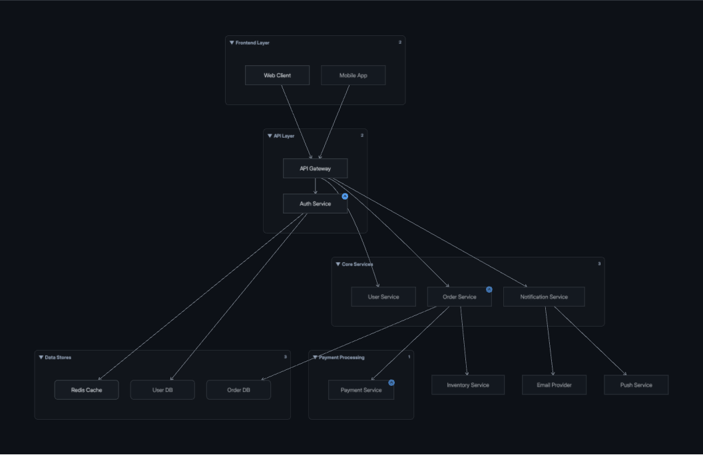
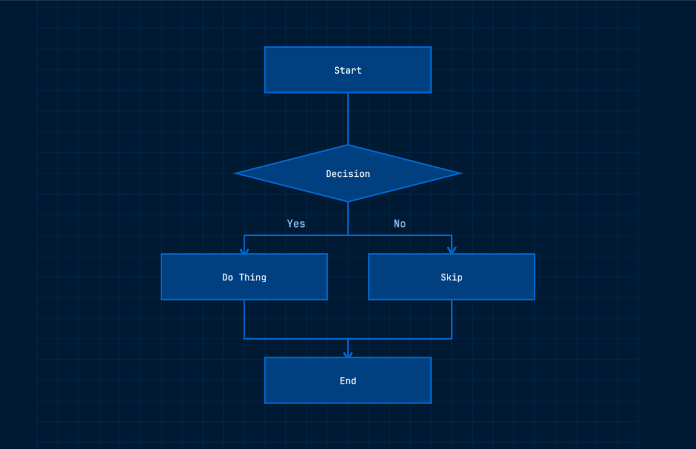
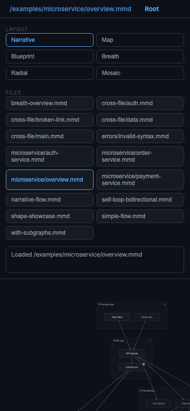
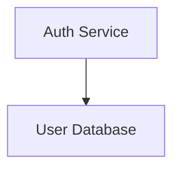

# mermaid-render

`@mermaid-render/core` is a framework-agnostic Mermaid rendering engine for the web. It mounts into a `<canvas>`, renders with PixiJS on a GPU backend, and adds zoom, pan, folding, and cross-file navigation.

## Why?

Mermaid is great for defining diagrams as code. But the output is a static SVG — no zoom, no folding, no way to handle complexity. Large diagrams become unreadable, and there's no way to split them across files.

mermaid-render fixes this: Mermaid syntax in, interactive GPU-rendered canvas out.

For the concrete list of product problems this repo is trying to solve, see:

- [Pain Points](docs/pain-points.md) for the explicit issue-backed problem list
- [Problem Statement](docs/superpowers/specs/2026-03-28-mermaid-render-design.md#1-problem-statement) for the broader design framing

## Screenshots

Narrative overview:



Blueprint flow:



Responsive mobile shell:



## v1 Scope

- **Interactive canvas** — zoom, pan, fit, reset, fold, and focus navigation
- **Embeddable core** — mount into any page that provides a `<canvas>`
- **Browser demo app** — static Vite build using bundled examples
- **Cross-file linking** — `%% @link` directives for in-browser multi-file navigation
- **Supported layouts** — `narrative` and `blueprint`
- **Supported Mermaid syntax** — `flowchart` today

The following philosophy names currently map to theme/spacing presets on top of Dagre rather than dedicated layout engines: `map`, `breath`, `radial`, `mosaic`.

The parser/runtime does **not** currently ship production support for Mermaid `classDiagram`, `stateDiagram`, or `C4` syntax. Any docs that mention those diagram families as a long-term fit for a philosophy are design intent, not a v1 compatibility claim.

## Embed

```ts
import {
  MermaidRenderer,
  createVirtualFileResolver,
} from '@mermaid-render/core'

const canvas = document.querySelector('canvas')
if (!canvas) throw new Error('Missing canvas')

const files = {
  '/examples/overview.mmd': `
    %% @link auth -> ./auth#loginNode
    graph TD
      auth[Auth] --> db[(DB)]
  `,
  '/examples/auth.mmd': `
    graph TD
      loginNode[Login] --> done[Done]
  `,
}

const renderer = new MermaidRenderer({
  themeMode: 'system',
  themeOverrides: {
    accent: 0x0969da,
  },
})
const linkResolver = createVirtualFileResolver(files)

await renderer.mount(canvas)
await renderer.load(files['/examples/overview.mmd'], {
  sourcePath: '/examples/overview.mmd',
  linkResolver,
})

// later
renderer.destroy()
```

Pass `sourcePath` and `linkResolver` when the diagram contains `%% @link` directives. For single-file diagrams, `await renderer.load(source)` is enough.

Public surface for v1:

- `new MermaidRenderer()`
- `mount(canvas)`
- `load(source, options?)`
- `loadGraph(graph)`
- `activateLink(nodeId)`
- `setPhilosophy(philosophy)`
- `setThemeMode(mode)`
- `setThemeOverrides(overrides)`
- `fitToView()`
- `resetView()`
- `foldNode()`, `unfoldNode()`, `foldAll()`, `unfoldAll()`
- `focusSubgraph()`, `focusOut()`, `focusTo()`
- `on()`, `off()`
- `destroy()`

Theme behavior:

- Default `themeMode` is `system`.
- In system-light environments, the default `narrative` palette resolves to a built-in light variant.
- The other shipped philosophies keep their current dark palettes unless the embedder supplies `themeOverrides`.
- `themeOverrides` are applied on top of the resolved palette, so embedders can supply a host-matched light palette without forking the renderer.

## Cross-File Linking

Link nodes across files using comment directives (ignored by standard Mermaid tools):



Resolver contract for browser embeds:

- `load(..., { sourcePath, linkResolver })` enables link validation and canonical path handling.
- `linkResolver.canonicalize(targetFile, fromFile)` must turn author-provided paths into one canonical `.mmd` key or return `null` for out-of-scope targets.
- `linkResolver.read(canonicalFile)` must return Mermaid source from an allowlisted or virtual file map. Core never fetches a raw author-supplied URL.
- Relative paths resolve from the current file, absolute paths stay rooted, extensionless targets gain `.mmd`, and `.` / `..` segments are normalized.

For virtual in-memory projects, use the exported helper:

```ts
import { createVirtualFileResolver, normalizeDiagramPath } from '@mermaid-render/core'
```

## Demo

Local demo:

```bash
pnpm --dir packages/core dev --host 127.0.0.1
```

Static demo build:

```bash
pnpm --filter @mermaid-render/core build:demo
```

Preview the built static artifact locally:

```bash
pnpm --filter @mermaid-render/core preview:demo
```

The output is written to `packages/core/dist-demo/` and can be served by any static host.

Release and deploy steps are documented in [docs/release.md](docs/release.md).

## Status

Active v1 web release work. See [goal.md](goal.md), [TASKS.md](TASKS.md), [docs/vision.md](docs/vision.md), [docs/tech.md](docs/tech.md), and [docs/release.md](docs/release.md) for the current scope and constraints.

## License

[MIT](LICENSE)
