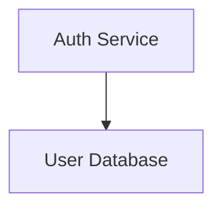

# mermaid-render

A high-performance, interactive rendering engine for [Mermaid](https://mermaid.js.org/) diagrams. WebGL-powered canvas with zoom, pan, node folding, and multi-file project support.

## Why?

Mermaid is great for defining diagrams as code. But the output is a static SVG — no zoom, no folding, no way to handle complexity. Large diagrams become unreadable, and there's no way to split them across files.

mermaid-render fixes this: Mermaid syntax in, interactive GPU-rendered canvas out.

## Features

- **Interactive canvas** — zoom, pan, smooth animations (WebGL via PixiJS)
- **Node folding** — collapse/expand diagram sections like code folding
- **Multi-file projects** — browse .mmd files in a folder, link across files
- **Cross-file navigation** — click a node to jump to another diagram
- **Backward compatible** — files remain valid Mermaid syntax
- **Embeddable** — standalone npm library, works anywhere with a canvas element

## Packages

| Package | Description |
|---------|-------------|
| `@mermaid-render/core` | Rendering engine (npm library) |
| `@mermaid-render/vscode` | VS Code extension |

## Cross-File Linking

Link nodes across files using comment directives (ignored by standard Mermaid tools):

## Status

Early development. See [docs/vision.md](docs/vision.md) for the product vision and [docs/tech.md](docs/tech.md) for technical decisions.

## License

[MIT](LICENSE)
