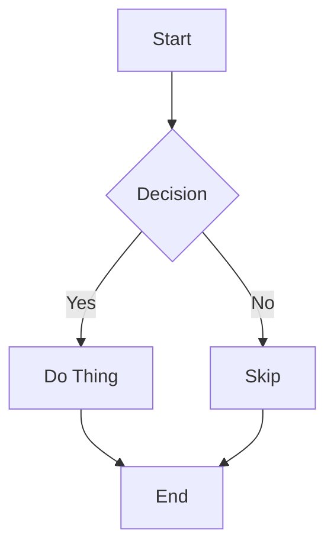
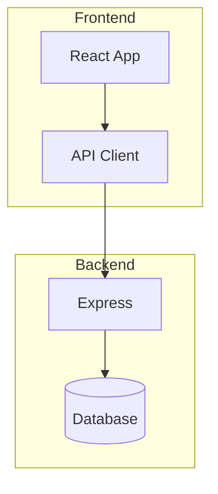
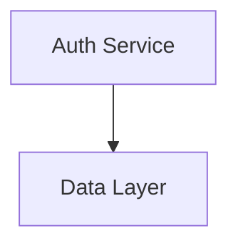
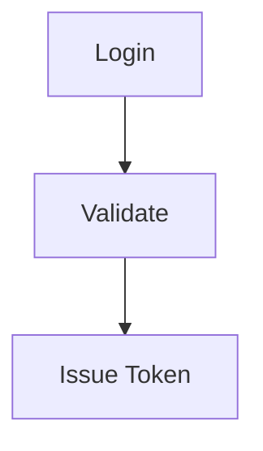
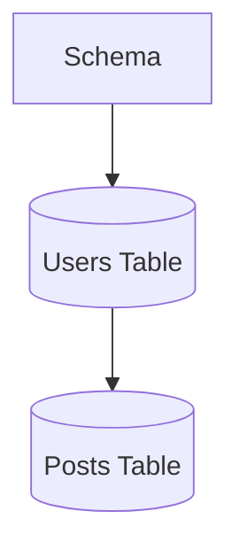

# mermaid-render Implementation Plan

> **For agentic workers:** REQUIRED SUB-SKILL: Use superpowers:subagent-driven-development (recommended) or superpowers:executing-plans to implement this plan task-by-task. Steps use checkbox (`- [ ]`) syntax for tracking.

**Goal:** Build an interactive Mermaid rendering engine (npm library) and VS Code extension with zoom/pan, node folding, multi-file support, cross-file linking, and Gestalt-based layout philosophies.

**Architecture:** pnpm monorepo with two packages — `@mermaid-render/core` (framework-agnostic rendering engine) and `@mermaid-render/vscode` (VS Code extension). Core parses Mermaid text via `mermaid` library's internal API, lays out via dagre, renders via PixiJS.

**Tech Stack:** TypeScript, PixiJS 8, mermaid (full library for parsing + db access), @dagrejs/dagre, pnpm workspaces, tsup, esbuild, vitest

**Known integration risks (see review):**
- Mermaid's internal `db` API is undocumented and varies between versions. Task 4 includes a spike step to inspect the actual API shape before writing adapter code.
- PixiJS 8 `BitmapText` requires a pre-loaded font atlas. Task 6 uses PixiJS `Text` (canvas-based) for v1 to avoid this blocker. MSDF BitmapText migration is a follow-up task.
- Mermaid requires a DOM environment. `jsdom` is a devDependency from the start and vitest uses `environment: 'jsdom'`.

**Spec:** `docs/superpowers/specs/2026-03-28-mermaid-render-design.md`
**Layout Philosophies:** `docs/layout-philosophies/*.md`

---

## Phase 1: Monorepo Scaffold

### Task 1: Initialize pnpm monorepo and core package

**Files:**
- Create: `package.json` (workspace root)
- Create: `pnpm-workspace.yaml`
- Create: `tsconfig.json` (base)
- Create: `.gitignore`
- Create: `packages/core/package.json`
- Create: `packages/core/tsconfig.json`
- Create: `packages/core/src/index.ts`

- [ ] **Step 1: Create root package.json**

```json
{
  "name": "mermaid-render",
  "private": true,
  "scripts": {
    "build": "pnpm -r build",
    "test": "pnpm -r test",
    "lint": "pnpm -r lint",
    "typecheck": "pnpm -r typecheck"
  },
  "devDependencies": {
    "typescript": "^5.7.0"
  },
  "engines": {
    "node": ">=20"
  }
}
```

- [ ] **Step 2: Create pnpm-workspace.yaml**

```yaml
packages:
  - 'packages/*'
```

- [ ] **Step 3: Create base tsconfig.json**

```json
{
  "compilerOptions": {
    "target": "ES2022",
    "module": "ESNext",
    "moduleResolution": "bundler",
    "lib": ["ES2022", "DOM", "DOM.Iterable"],
    "strict": true,
    "esModuleInterop": true,
    "skipLibCheck": true,
    "forceConsistentCasingInFileNames": true,
    "resolveJsonModule": true,
    "declaration": true,
    "declarationMap": true,
    "sourceMap": true,
    "outDir": "dist",
    "rootDir": "src"
  }
}
```

- [ ] **Step 4: Create .gitignore**

```
node_modules/
dist/
*.tsbuildinfo
.turbo/
```

- [ ] **Step 5: Create core package**

`packages/core/package.json`:
```json
{
  "name": "@mermaid-render/core",
  "version": "0.1.0",
  "description": "Interactive Mermaid diagram rendering engine",
  "type": "module",
  "main": "./dist/index.cjs",
  "module": "./dist/index.js",
  "types": "./dist/index.d.ts",
  "exports": {
    ".": {
      "import": "./dist/index.js",
      "require": "./dist/index.cjs",
      "types": "./dist/index.d.ts"
    }
  },
  "files": ["dist"],
  "scripts": {
    "build": "tsup",
    "test": "vitest run",
    "test:watch": "vitest",
    "lint": "eslint src",
    "typecheck": "tsc --noEmit"
  },
  "dependencies": {
    "mermaid": "11.4.1",
    "@dagrejs/dagre": "^1.1.4",
    "pixi.js": "^8.6.0"
  },
  "devDependencies": {
    "tsup": "^8.3.0",
    "vitest": "^3.0.0",
    "jsdom": "^25.0.0",
    "typescript": "^5.7.0"
  },
  "license": "MIT"
}
```

`packages/core/tsconfig.json`:
```json
{
  "extends": "../../tsconfig.json",
  "compilerOptions": {
    "outDir": "dist",
    "rootDir": "src"
  },
  "include": ["src"]
}
```

`packages/core/tsup.config.ts`:
```typescript
import { defineConfig } from 'tsup'

export default defineConfig({
  entry: ['src/index.ts'],
  format: ['esm', 'cjs'],
  dts: true,
  sourcemap: true,
  clean: true,
  external: ['pixi.js']
})
```

`packages/core/src/index.ts`:
```typescript
export { MermaidRenderer } from './renderer/mermaid-renderer'
export type * from './types'
```

- [ ] **Step 6: Install dependencies**

Run: `pnpm install`
Expected: Successful install, lockfile generated.

- [ ] **Step 7: Verify build**

Run: `cd packages/core && pnpm build`
Expected: dist/ folder created with index.js, index.cjs, index.d.ts (will have build errors until we create the referenced files — that's fine, we just want the toolchain working).

- [ ] **Step 8: Commit**

```bash
git add package.json pnpm-workspace.yaml pnpm-lock.yaml tsconfig.json .gitignore packages/core/
git commit -m "scaffold: initialize pnpm monorepo with @mermaid-render/core package"
```

---

## Phase 2: Types and Internal Graph Model

### Task 2: Define core types

**Files:**
- Create: `packages/core/src/types.ts`
- Test: `packages/core/src/__tests__/types.test.ts`

- [ ] **Step 1: Write the types file**

```typescript
// packages/core/src/types.ts

// --- Graph Model ---

export interface RenderGraph {
  nodes: Map<string, RenderNode>
  edges: RenderEdge[]
  subgraphs: Map<string, RenderSubgraph>
  directives: Directive[]
  direction: 'TD' | 'LR' | 'RL' | 'BT'
  diagramType: DiagramType
}

export type DiagramType = 'flowchart' | 'classDiagram' | 'c4' | 'stateDiagram' | 'unknown'

export interface RenderNode {
  id: string
  label: string
  shape: NodeShape
  children?: string[]
  links?: CrossFileLink[]
  metadata: Record<string, unknown>
}

export type NodeShape =
  | 'rectangle'
  | 'rounded'
  | 'circle'
  | 'diamond'
  | 'hexagon'
  | 'stadium'
  | 'cylinder'
  | 'subroutine'
  | 'asymmetric'
  | 'unknown'

export interface CrossFileLink {
  targetFile: string
  targetNode?: string
}

export interface RenderEdge {
  id: string
  source: string
  target: string
  label?: string
  style: EdgeStyle
}

export type EdgeStyle = 'solid' | 'dotted' | 'thick'

export interface RenderSubgraph {
  id: string
  label: string
  nodeIds: string[]
  parentId?: string
  collapsed: boolean
}

// --- Directives ---

export type Directive = LinkDirective | LayoutDirective | PinDirective | RankDirective | SpacingDirective

export interface LinkDirective {
  type: 'link'
  nodeId: string
  targetFile: string
  targetNode?: string
}

export interface LayoutDirective {
  type: 'layout'
  philosophy: LayoutPhilosophy
}

export interface PinDirective {
  type: 'pin'
  nodeId: string
  x: number
  y: number
}

export interface RankDirective {
  type: 'rank'
  nodeIds: string[]
}

export interface SpacingDirective {
  type: 'spacing'
  multiplier: number
}

export type LayoutPhilosophy = 'narrative' | 'map' | 'blueprint' | 'breath'

// --- Layout Output ---

export interface PositionedGraph {
  nodes: Map<string, PositionedNode>
  edges: PositionedEdge[]
  subgraphs: Map<string, PositionedSubgraph>
  width: number
  height: number
}

export interface PositionedNode {
  id: string
  x: number
  y: number
  width: number
  height: number
  data: RenderNode
}

export interface PositionedEdge {
  id: string
  points: Array<{ x: number; y: number }>
  data: RenderEdge
}

export interface PositionedSubgraph {
  id: string
  x: number
  y: number
  width: number
  height: number
  data: RenderSubgraph
}

// --- Renderer API ---

export interface LoadResult {
  success: boolean
  graph?: RenderGraph
  errors?: RenderError[]
  warnings?: RenderWarning[]
}

export interface RenderError {
  code: string
  message: string
  line?: number
}

export interface RenderWarning {
  code: string
  message: string
  nodeId?: string
}

export interface NodeEvent {
  nodeId: string
  node: RenderNode
  x: number
  y: number
  originalEvent: PointerEvent
}

export interface LoadOptions {
  layout?: LayoutPhilosophy
}
```

- [ ] **Step 2: Write type validation test**

```typescript
// packages/core/src/__tests__/types.test.ts
import { describe, it, expect } from 'vitest'
import type {
  RenderGraph,
  RenderNode,
  RenderEdge,
  RenderSubgraph,
  LinkDirective,
  LayoutDirective,
  PositionedGraph,
  LoadResult,
} from '../types'

describe('types', () => {
  it('can construct a RenderGraph', () => {
    const node: RenderNode = {
      id: 'A',
      label: 'Node A',
      shape: 'rectangle',
      metadata: {},
    }
    const edge: RenderEdge = {
      id: 'A->B',
      source: 'A',
      target: 'B',
      style: 'solid',
    }
    const subgraph: RenderSubgraph = {
      id: 'sg1',
      label: 'Group',
      nodeIds: ['A'],
      collapsed: false,
    }
    const graph: RenderGraph = {
      nodes: new Map([['A', node]]),
      edges: [edge],
      subgraphs: new Map([['sg1', subgraph]]),
      directives: [],
      direction: 'TD',
      diagramType: 'flowchart',
    }

    expect(graph.nodes.get('A')).toBe(node)
    expect(graph.edges).toHaveLength(1)
    expect(graph.subgraphs.get('sg1')?.collapsed).toBe(false)
  })

  it('can construct directives', () => {
    const link: LinkDirective = {
      type: 'link',
      nodeId: 'A',
      targetFile: '/path/to/file.mmd',
      targetNode: 'nodeB',
    }
    const layout: LayoutDirective = {
      type: 'layout',
      philosophy: 'narrative',
    }

    expect(link.type).toBe('link')
    expect(layout.philosophy).toBe('narrative')
  })

  it('can construct LoadResult', () => {
    const result: LoadResult = {
      success: true,
      errors: [],
      warnings: [],
    }
    expect(result.success).toBe(true)
  })
})
```

- [ ] **Step 3: Create vitest config**

`packages/core/vitest.config.ts`:
```typescript
import { defineConfig } from 'vitest/config'

export default defineConfig({
  test: {
    include: ['src/**/*.test.ts'],
    environment: 'jsdom',
  },
})
```

- [ ] **Step 4: Run test**

Run: `cd packages/core && pnpm test`
Expected: PASS — types compile and objects construct correctly.

- [ ] **Step 5: Commit**

```bash
git add packages/core/src/types.ts packages/core/src/__tests__/types.test.ts packages/core/vitest.config.ts
git commit -m "feat: define core types — graph model, directives, layout output, renderer API"
```

---

## Phase 3: Parser Layer

### Task 3: Directive extractor

**Files:**
- Create: `packages/core/src/parser/directive-extractor.ts`
- Test: `packages/core/src/parser/__tests__/directive-extractor.test.ts`

- [ ] **Step 1: Write failing tests**

```typescript
// packages/core/src/parser/__tests__/directive-extractor.test.ts
import { describe, it, expect } from 'vitest'
import { extractDirectives } from '../directive-extractor'

describe('extractDirectives', () => {
  it('extracts @link directives with full path and fragment', () => {
    const input = `%% @link nodeA -> /services/auth/flow.mmd#loginNode
graph TD
    nodeA[Auth] --> nodeB[DB]`

    const result = extractDirectives(input)

    expect(result.directives).toHaveLength(1)
    expect(result.directives[0]).toEqual({
      type: 'link',
      nodeId: 'nodeA',
      targetFile: '/services/auth/flow.mmd',
      targetNode: 'loginNode',
    })
    expect(result.cleanedSource).toBe(`graph TD
    nodeA[Auth] --> nodeB[DB]`)
  })

  it('extracts @link without fragment', () => {
    const input = `%% @link nodeA -> /services/auth/flow.mmd
graph TD
    nodeA[Auth]`

    const result = extractDirectives(input)

    expect(result.directives[0]).toEqual({
      type: 'link',
      nodeId: 'nodeA',
      targetFile: '/services/auth/flow.mmd',
      targetNode: undefined,
    })
  })

  it('extracts multiple directives', () => {
    const input = `%% @link A -> /a.mmd#x
%% @link B -> /b.mmd
%% @layout narrative
graph TD
    A --> B`

    const result = extractDirectives(input)

    expect(result.directives).toHaveLength(3)
    expect(result.directives[2]).toEqual({
      type: 'layout',
      philosophy: 'narrative',
    })
  })

  it('extracts @pin directives', () => {
    const input = `%% @pin nodeA 200 150
graph TD
    nodeA[Auth]`

    const result = extractDirectives(input)

    expect(result.directives[0]).toEqual({
      type: 'pin',
      nodeId: 'nodeA',
      x: 200,
      y: 150,
    })
  })

  it('extracts @rank directives', () => {
    const input = `%% @rank nodeA nodeB nodeC
graph TD
    nodeA --> nodeB`

    const result = extractDirectives(input)

    expect(result.directives[0]).toEqual({
      type: 'rank',
      nodeIds: ['nodeA', 'nodeB', 'nodeC'],
    })
  })

  it('extracts @spacing directives', () => {
    const input = `%% @spacing 1.5
graph TD
    A --> B`

    const result = extractDirectives(input)

    expect(result.directives[0]).toEqual({
      type: 'spacing',
      multiplier: 1.5,
    })
  })

  it('returns empty directives for plain mermaid', () => {
    const input = `graph TD
    A --> B`

    const result = extractDirectives(input)

    expect(result.directives).toHaveLength(0)
    expect(result.cleanedSource).toBe(input)
  })

  it('preserves regular mermaid comments', () => {
    const input = `%% This is a normal comment
graph TD
    A --> B`

    const result = extractDirectives(input)

    expect(result.directives).toHaveLength(0)
    expect(result.cleanedSource).toContain('%% This is a normal comment')
  })
})
```

- [ ] **Step 2: Run tests to verify they fail**

Run: `cd packages/core && pnpm test -- src/parser/__tests__/directive-extractor.test.ts`
Expected: FAIL — module not found.

- [ ] **Step 3: Implement directive extractor**

```typescript
// packages/core/src/parser/directive-extractor.ts
import type { Directive, LinkDirective, LayoutDirective, PinDirective, RankDirective, SpacingDirective, LayoutPhilosophy } from '../types'

export interface ExtractResult {
  directives: Directive[]
  cleanedSource: string
}

const LINK_RE = /^%%\s*@link\s+(\S+)\s*->\s*(\S+?)(?:#(\S+))?\s*$/
const LAYOUT_RE = /^%%\s*@layout\s+(narrative|map|blueprint|breath)\s*$/
const PIN_RE = /^%%\s*@pin\s+(\S+)\s+(\d+(?:\.\d+)?)\s+(\d+(?:\.\d+)?)\s*$/
const RANK_RE = /^%%\s*@rank\s+(.+)\s*$/
const SPACING_RE = /^%%\s*@spacing\s+(\d+(?:\.\d+)?)\s*$/

export function extractDirectives(source: string): ExtractResult {
  const lines = source.split('\n')
  const directives: Directive[] = []
  const cleanedLines: string[] = []

  for (const line of lines) {
    const trimmed = line.trim()
    let match: RegExpMatchArray | null

    if ((match = trimmed.match(LINK_RE))) {
      const directive: LinkDirective = {
        type: 'link',
        nodeId: match[1],
        targetFile: match[2],
        targetNode: match[3] || undefined,
      }
      directives.push(directive)
    } else if ((match = trimmed.match(LAYOUT_RE))) {
      const directive: LayoutDirective = {
        type: 'layout',
        philosophy: match[1] as LayoutPhilosophy,
      }
      directives.push(directive)
    } else if ((match = trimmed.match(PIN_RE))) {
      const directive: PinDirective = {
        type: 'pin',
        nodeId: match[1],
        x: parseFloat(match[2]),
        y: parseFloat(match[3]),
      }
      directives.push(directive)
    } else if ((match = trimmed.match(RANK_RE))) {
      const directive: RankDirective = {
        type: 'rank',
        nodeIds: match[1].trim().split(/\s+/),
      }
      directives.push(directive)
    } else if ((match = trimmed.match(SPACING_RE))) {
      const directive: SpacingDirective = {
        type: 'spacing',
        multiplier: parseFloat(match[1]),
      }
      directives.push(directive)
    } else {
      cleanedLines.push(line)
    }
  }

  return {
    directives,
    cleanedSource: cleanedLines.join('\n'),
  }
}
```

- [ ] **Step 4: Run tests to verify they pass**

Run: `cd packages/core && pnpm test -- src/parser/__tests__/directive-extractor.test.ts`
Expected: ALL PASS.

- [ ] **Step 5: Commit**

```bash
git add packages/core/src/parser/
git commit -m "feat: directive extractor — parses @link, @layout, @pin, @rank, @spacing from comments"
```

---

### Task 4: Mermaid adapter and flowchart graph builder

This is the critical integration point. We use mermaid's full library to parse, then extract nodes/edges/subgraphs from its internal database.

**Files:**
- Create: `packages/core/src/parser/mermaid-adapter.ts`
- Create: `packages/core/src/parser/adapters/flowchart.ts`
- Create: `packages/core/src/parser/graph-builder.ts`
- Test: `packages/core/src/parser/__tests__/graph-builder.test.ts`

- [ ] **Step 1: Write failing tests**

```typescript
// packages/core/src/parser/__tests__/graph-builder.test.ts
import { describe, it, expect } from 'vitest'
import { buildGraph } from '../graph-builder'

describe('buildGraph', () => {
  it('parses a simple flowchart with two nodes and one edge', async () => {
    const source = `graph TD
    A[Hello] --> B[World]`

    const result = await buildGraph(source)

    expect(result.success).toBe(true)
    expect(result.graph!.diagramType).toBe('flowchart')
    expect(result.graph!.direction).toBe('TD')
    expect(result.graph!.nodes.size).toBe(2)
    expect(result.graph!.nodes.get('A')?.label).toBe('Hello')
    expect(result.graph!.nodes.get('B')?.label).toBe('World')
    expect(result.graph!.edges).toHaveLength(1)
    expect(result.graph!.edges[0].source).toBe('A')
    expect(result.graph!.edges[0].target).toBe('B')
  })

  it('parses subgraphs', async () => {
    const source = `graph TD
    subgraph sg1[Group One]
        A[Node A]
        B[Node B]
    end
    A --> B`

    const result = await buildGraph(source)

    expect(result.success).toBe(true)
    expect(result.graph!.subgraphs.size).toBeGreaterThanOrEqual(1)
    const sg = Array.from(result.graph!.subgraphs.values()).find(s => s.label === 'Group One')
    expect(sg).toBeDefined()
    expect(sg!.nodeIds).toContain('A')
    expect(sg!.nodeIds).toContain('B')
  })

  it('parses directives and attaches links to nodes', async () => {
    const source = `%% @link A -> /path/to/file.mmd#nodeX
graph TD
    A[Auth] --> B[DB]`

    const result = await buildGraph(source)

    expect(result.success).toBe(true)
    const nodeA = result.graph!.nodes.get('A')
    expect(nodeA?.links).toHaveLength(1)
    expect(nodeA?.links![0].targetFile).toBe('/path/to/file.mmd')
    expect(nodeA?.links![0].targetNode).toBe('nodeX')
  })

  it('detects layout philosophy from directive', async () => {
    const source = `%% @layout blueprint
graph TD
    A --> B`

    const result = await buildGraph(source)

    expect(result.success).toBe(true)
    const layoutDir = result.graph!.directives.find(d => d.type === 'layout')
    expect(layoutDir).toBeDefined()
  })

  it('returns errors for invalid mermaid syntax', async () => {
    const source = `this is not valid mermaid`

    const result = await buildGraph(source)

    expect(result.success).toBe(false)
    expect(result.errors).toBeDefined()
    expect(result.errors!.length).toBeGreaterThan(0)
    expect(result.errors![0].code).toBe('PARSE_FAILED')
  })

  it('parses edge labels', async () => {
    const source = `graph TD
    A -->|yes| B
    A -->|no| C`

    const result = await buildGraph(source)

    expect(result.success).toBe(true)
    expect(result.graph!.edges).toHaveLength(2)
    const yesEdge = result.graph!.edges.find(e => e.target === 'B')
    expect(yesEdge?.label).toBe('yes')
  })

  it('parses different node shapes', async () => {
    const source = `graph TD
    A[Rectangle]
    B(Rounded)
    C{Diamond}
    D([Stadium])
    E[(Cylinder)]
    F((Circle))`

    const result = await buildGraph(source)

    expect(result.success).toBe(true)
    expect(result.graph!.nodes.size).toBe(6)
  })
})
```

- [ ] **Step 2: Run tests to verify they fail**

Run: `cd packages/core && pnpm test -- src/parser/__tests__/graph-builder.test.ts`
Expected: FAIL — modules not found.

- [ ] **Step 3: Spike — discover mermaid's internal API**

Before writing the adapter, run a spike to discover the actual API shape. Mermaid's internal `db` API is undocumented and changes between versions. Create a temporary spike script:

```typescript
// packages/core/src/parser/_spike.ts (temporary — delete after)
import mermaid from 'mermaid'

mermaid.initialize({ startOnLoad: false })

async function spike() {
  const source = `graph TD
    A[Hello] --> B[World]
    subgraph sg1[Group]
      B
    end`

  // Try different APIs to find how to get the parsed db:
  // Option A: mermaid.parse() + internal Diagram class
  // Option B: mermaid.mermaidAPI methods
  // Option C: import { Diagram } from 'mermaid/dist/Diagram' or similar internal path

  // Log everything available:
  const parseResult = await mermaid.parse(source)
  console.log('parse result:', JSON.stringify(parseResult, null, 2))

  // Try to access Diagram class — this is the most likely path in mermaid 11.x:
  try {
    const { Diagram } = await import('mermaid')
    // or: const { Diagram } = await import('mermaid/dist/Diagram.js')
    const diagram = await Diagram.fromText(source)
    console.log('diagram.type:', diagram.type)
    console.log('diagram.db keys:', Object.keys(diagram.db))
    console.log('diagram.db.getData?.():', JSON.stringify(diagram.db.getData?.(), null, 2))
    console.log('diagram.db.getVertices?.():', diagram.db.getVertices?.())
    console.log('diagram.db.getEdges?.():', diagram.db.getEdges?.())
    console.log('diagram.db.getSubGraphs?.():', diagram.db.getSubGraphs?.())
    console.log('diagram.db.getDirection?.():', diagram.db.getDirection?.())
  } catch (e) {
    console.error('Diagram import failed:', e)
  }
}

spike()
```

Run this via: `npx tsx packages/core/src/parser/_spike.ts` (or via the dev harness in the browser).

Use the output to write the actual adapter. The spike reveals:
- Which import path gives access to `Diagram`
- Whether `db.getData()` or `db.getVertices()` is the correct method
- The actual shape of nodes, edges, and subgraphs

- [ ] **Step 4: Implement mermaid adapter (based on spike findings)**

```typescript
// packages/core/src/parser/mermaid-adapter.ts
import mermaid from 'mermaid'
import type { DiagramType } from '../types'

// Initialize mermaid for parsing only — no rendering
mermaid.initialize({
  startOnLoad: false,
  suppressErrorRendering: true,
})

export interface MermaidParseResult {
  diagramType: DiagramType
  db: any // Mermaid's internal DiagramDB — varies per diagram type
  direction?: string
}

const TYPE_MAP: Record<string, DiagramType> = {
  flowchart: 'flowchart',
  'flowchart-v2': 'flowchart',
  classDiagram: 'classDiagram',
  'classDiagram-v2': 'classDiagram',
  c4: 'c4',
  stateDiagram: 'stateDiagram',
  'stateDiagram-v2': 'stateDiagram',
}

export async function parseMermaid(source: string): Promise<MermaidParseResult> {
  // IMPORTANT: The exact API below must be verified against the spike output.
  // Mermaid 11.x exposes Diagram.fromText() which gives access to the db.
  // If this import path doesn't work, check:
  //   - import { Diagram } from 'mermaid'
  //   - import { Diagram } from 'mermaid/dist/Diagram.js'
  //   - Access via mermaid.mermaidAPI internals
  const { Diagram } = await import('mermaid')
  const diagram = await Diagram.fromText(source)

  const detectedType = diagram.type ?? 'unknown'
  const diagramType = TYPE_MAP[detectedType] ?? 'unknown'
  const db = diagram.db

  return {
    diagramType,
    db,
    direction: db.getDirection?.() ?? 'TD',
  }
}
```

**Key:** Adapt property access based on what the spike revealed. Delete `_spike.ts` after.

- [ ] **Step 4: Implement flowchart adapter**

```typescript
// packages/core/src/parser/adapters/flowchart.ts
import type { RenderGraph, RenderNode, RenderEdge, RenderSubgraph, NodeShape, EdgeStyle } from '../../types'

// Maps mermaid internal shape names to our NodeShape type
function mapShape(mermaidShape: string | undefined): NodeShape {
  const shapeMap: Record<string, NodeShape> = {
    rect: 'rectangle',
    square: 'rectangle',
    round: 'rounded',
    circle: 'circle',
    diamond: 'diamond',
    'odd-right': 'asymmetric',
    stadium: 'stadium',
    cylinder: 'cylinder',
    'double-circle': 'circle',
    hexagon: 'hexagon',
    subroutine: 'subroutine',
    'lean-right': 'asymmetric',
    'lean-left': 'asymmetric',
    trapezoid: 'asymmetric',
    'inv-trapezoid': 'asymmetric',
  }
  return shapeMap[mermaidShape ?? ''] ?? 'rectangle'
}

function mapEdgeStyle(stroke: string | undefined): EdgeStyle {
  if (stroke === 'dotted') return 'dotted'
  if (stroke === 'thick') return 'thick'
  return 'solid'
}

export function buildFlowchartGraph(db: any, direction: string): RenderGraph {
  const nodes = new Map<string, RenderNode>()
  const edges: RenderEdge[] = []
  const subgraphs = new Map<string, RenderSubgraph>()

  // Extract nodes from mermaid's db
  // Mermaid stores vertices in db.getVertices() or db.getData().nodes
  const data = db.getData?.() ?? {}
  const vertices = data.nodes ?? db.getVertices?.() ?? {}

  // Process vertices — may be an array or a Map/Object
  const vertexEntries = vertices instanceof Map
    ? Array.from(vertices.entries())
    : Array.isArray(vertices)
      ? vertices.map((v: any) => [v.id, v])
      : Object.entries(vertices)

  for (const [id, vertex] of vertexEntries) {
    const v = vertex as any
    nodes.set(String(id), {
      id: String(id),
      label: v.label ?? v.text ?? String(id),
      shape: mapShape(v.type ?? v.shape),
      metadata: {},
    })
  }

  // Extract edges
  const mermaidEdges = data.edges ?? db.getEdges?.() ?? []
  for (let i = 0; i < mermaidEdges.length; i++) {
    const e = mermaidEdges[i]
    edges.push({
      id: `e-${i}`,
      source: String(e.start ?? e.source),
      target: String(e.end ?? e.target),
      label: e.text ?? e.label ?? undefined,
      style: mapEdgeStyle(e.stroke),
    })
  }

  // Extract subgraphs
  const mermaidSubgraphs = data.subGraphs ?? db.getSubGraphs?.() ?? []
  for (const sg of mermaidSubgraphs) {
    subgraphs.set(sg.id, {
      id: sg.id,
      label: sg.title ?? sg.label ?? sg.id,
      nodeIds: (sg.nodes ?? []).map(String),
      collapsed: false,
    })
  }

  return {
    nodes,
    edges,
    subgraphs,
    directives: [],
    direction: (direction as RenderGraph['direction']) ?? 'TD',
    diagramType: 'flowchart',
  }
}
```

- [ ] **Step 5: Implement graph builder (orchestrator)**

```typescript
// packages/core/src/parser/graph-builder.ts
import type { RenderGraph, LoadResult, LinkDirective, RenderWarning } from '../types'
import { extractDirectives } from './directive-extractor'
import { parseMermaid } from './mermaid-adapter'
import { buildFlowchartGraph } from './adapters/flowchart'

export async function buildGraph(source: string): Promise<LoadResult> {
  // Step 1: Extract our custom directives
  const { directives, cleanedSource } = extractDirectives(source)

  // Step 2: Parse with mermaid
  let parsed
  try {
    parsed = await parseMermaid(cleanedSource)
  } catch (err: any) {
    return {
      success: false,
      errors: [{
        code: 'PARSE_FAILED',
        message: err.message ?? 'Failed to parse Mermaid syntax',
      }],
    }
  }

  // Step 3: Build graph using diagram-type-specific adapter
  let graph: RenderGraph
  switch (parsed.diagramType) {
    case 'flowchart':
      graph = buildFlowchartGraph(parsed.db, parsed.direction ?? 'TD')
      break
    default:
      // For now, try flowchart adapter as fallback
      try {
        graph = buildFlowchartGraph(parsed.db, parsed.direction ?? 'TD')
      } catch {
        return {
          success: false,
          errors: [{
            code: 'UNSUPPORTED_DIAGRAM',
            message: `Diagram type "${parsed.diagramType}" is not yet supported`,
          }],
        }
      }
  }

  // Step 4: Attach directives to graph
  graph.directives = directives
  const warnings: RenderWarning[] = []

  // Attach @link directives to their nodes
  for (const dir of directives) {
    if (dir.type === 'link') {
      const node = graph.nodes.get(dir.nodeId)
      if (node) {
        if (!node.links) node.links = []
        node.links.push({
          targetFile: dir.targetFile,
          targetNode: dir.targetNode,
        })
      } else {
        warnings.push({
          code: 'LINK_NODE_NOT_FOUND',
          message: `@link directive references unknown node "${dir.nodeId}"`,
          nodeId: dir.nodeId,
        })
      }
    }
  }

  return {
    success: true,
    graph,
    warnings: warnings.length > 0 ? warnings : undefined,
  }
}
```

- [ ] **Step 6: Run tests**

Run: `cd packages/core && pnpm test -- src/parser/__tests__/graph-builder.test.ts`

Note: These tests use mermaid's real parser, which requires a DOM environment. If tests fail because mermaid needs jsdom, add to `vitest.config.ts`:
```typescript
export default defineConfig({
  test: {
    include: ['src/**/*.test.ts'],
    environment: 'jsdom',
  },
})
```
And install: `pnpm add -D jsdom`

The mermaid adapter will likely need iteration — mermaid's internal API varies between versions. Debug by logging `db` and `db.getData()` to see the actual structure. Adjust the flowchart adapter's property access accordingly (e.g., `getVertices` vs `getData().nodes`). This is expected — the adapter layer exists specifically to absorb this instability.

Expected: Tests pass for basic flowchart parsing.

- [ ] **Step 7: Commit**

```bash
git add packages/core/src/parser/
git commit -m "feat: parser layer — mermaid adapter + flowchart graph builder with directive attachment"
```

---

## Phase 4: Layout Engine

### Task 5: Layout engine interface and dagre implementation

**Files:**
- Create: `packages/core/src/layout/layout-engine.ts`
- Create: `packages/core/src/layout/dagre-layout.ts`
- Create: `packages/core/src/layout/philosophy-config.ts`
- Test: `packages/core/src/layout/__tests__/dagre-layout.test.ts`

- [ ] **Step 1: Write failing tests**

```typescript
// packages/core/src/layout/__tests__/dagre-layout.test.ts
import { describe, it, expect } from 'vitest'
import { DagreLayout } from '../dagre-layout'
import type { RenderGraph, RenderNode, RenderEdge } from '../../types'

function makeGraph(opts?: { collapsed?: string[] }): RenderGraph {
  const nodes = new Map<string, RenderNode>([
    ['A', { id: 'A', label: 'Node A', shape: 'rectangle', metadata: {} }],
    ['B', { id: 'B', label: 'Node B', shape: 'rectangle', metadata: {} }],
    ['C', { id: 'C', label: 'Node C', shape: 'rectangle', metadata: {} }],
  ])
  const edges: RenderEdge[] = [
    { id: 'e0', source: 'A', target: 'B', style: 'solid' },
    { id: 'e1', source: 'B', target: 'C', style: 'solid' },
  ]
  return {
    nodes,
    edges,
    subgraphs: new Map([
      ['sg1', { id: 'sg1', label: 'Group', nodeIds: ['B', 'C'], collapsed: opts?.collapsed?.includes('sg1') ?? false }],
    ]),
    directives: [],
    direction: 'TD',
    diagramType: 'flowchart',
  }
}

describe('DagreLayout', () => {
  it('positions all visible nodes', () => {
    const layout = new DagreLayout()
    const result = layout.compute(makeGraph())

    expect(result.nodes.size).toBe(3)
    for (const [, node] of result.nodes) {
      expect(node.x).toBeDefined()
      expect(node.y).toBeDefined()
      expect(node.width).toBeGreaterThan(0)
      expect(node.height).toBeGreaterThan(0)
    }
  })

  it('produces edges with at least 2 waypoints', () => {
    const layout = new DagreLayout()
    const result = layout.compute(makeGraph())

    expect(result.edges.length).toBe(2)
    for (const edge of result.edges) {
      expect(edge.points.length).toBeGreaterThanOrEqual(2)
    }
  })

  it('does not overlap nodes', () => {
    const layout = new DagreLayout()
    const result = layout.compute(makeGraph())

    const positioned = Array.from(result.nodes.values())
    for (let i = 0; i < positioned.length; i++) {
      for (let j = i + 1; j < positioned.length; j++) {
        const a = positioned[i]
        const b = positioned[j]
        const overlapX = Math.abs(a.x - b.x) < (a.width + b.width) / 2
        const overlapY = Math.abs(a.y - b.y) < (a.height + b.height) / 2
        expect(overlapX && overlapY).toBe(false)
      }
    }
  })

  it('excludes folded children from layout', () => {
    const layout = new DagreLayout()
    const graph = makeGraph({ collapsed: ['sg1'] })
    const result = layout.compute(graph)

    // B and C are inside sg1 which is collapsed — they should not be in output
    // Instead, a summary node for sg1 should appear
    expect(result.nodes.has('B')).toBe(false)
    expect(result.nodes.has('C')).toBe(false)
    expect(result.nodes.has('sg1')).toBe(true) // summary node
  })

  it('applies philosophy spacing config', () => {
    const narrow = new DagreLayout({ philosophy: 'blueprint' })
    const wide = new DagreLayout({ philosophy: 'breath' })

    const narrowResult = narrow.compute(makeGraph())
    const wideResult = wide.compute(makeGraph())

    // Breath philosophy should produce larger overall dimensions
    expect(wideResult.height).toBeGreaterThan(narrowResult.height)
  })
})
```

- [ ] **Step 2: Run tests to verify they fail**

Run: `cd packages/core && pnpm test -- src/layout/__tests__/dagre-layout.test.ts`
Expected: FAIL — modules not found.

- [ ] **Step 3: Implement philosophy config**

```typescript
// packages/core/src/layout/philosophy-config.ts
import type { LayoutPhilosophy } from '../types'

export interface PhilosophyConfig {
  nodeSep: number      // Horizontal separation between nodes
  rankSep: number      // Vertical separation between ranks
  edgeSep: number      // Separation between edges
  rankDir: 'TB' | 'LR' | 'BT' | 'RL'
  marginX: number
  marginY: number
  nodeMinWidth: number
  nodeMinHeight: number
  nodePadding: number
}

const NARRATIVE: PhilosophyConfig = {
  nodeSep: 50,
  rankSep: 60,
  edgeSep: 15,
  rankDir: 'TB',
  marginX: 40,
  marginY: 40,
  nodeMinWidth: 120,
  nodeMinHeight: 40,
  nodePadding: 12,
}

const MAP: PhilosophyConfig = {
  nodeSep: 40,
  rankSep: 50,
  edgeSep: 20,
  rankDir: 'TB',
  marginX: 60,
  marginY: 60,
  nodeMinWidth: 100,
  nodeMinHeight: 40,
  nodePadding: 16,
}

const BLUEPRINT: PhilosophyConfig = {
  nodeSep: 30,
  rankSep: 40,
  edgeSep: 10,
  rankDir: 'TB',
  marginX: 20,
  marginY: 20,
  nodeMinWidth: 100,
  nodeMinHeight: 36,
  nodePadding: 8,
}

const BREATH: PhilosophyConfig = {
  nodeSep: 100,
  rankSep: 120,
  edgeSep: 30,
  rankDir: 'TB',
  marginX: 80,
  marginY: 80,
  nodeMinWidth: 160,
  nodeMinHeight: 56,
  nodePadding: 20,
}

const CONFIGS: Record<LayoutPhilosophy, PhilosophyConfig> = {
  narrative: NARRATIVE,
  map: MAP,
  blueprint: BLUEPRINT,
  breath: BREATH,
}

export function getPhilosophyConfig(philosophy: LayoutPhilosophy): PhilosophyConfig {
  return CONFIGS[philosophy]
}
```

- [ ] **Step 4: Implement layout engine interface**

```typescript
// packages/core/src/layout/layout-engine.ts
import type { RenderGraph, PositionedGraph, LayoutPhilosophy } from '../types'

export interface LayoutEngine {
  compute(graph: RenderGraph): PositionedGraph
}

export interface LayoutOptions {
  philosophy?: LayoutPhilosophy
  spacingMultiplier?: number
}
```

- [ ] **Step 5: Implement dagre layout**

```typescript
// packages/core/src/layout/dagre-layout.ts
import dagre from '@dagrejs/dagre'
import type { RenderGraph, PositionedGraph, PositionedNode, PositionedEdge, PositionedSubgraph, LayoutPhilosophy } from '../types'
import type { LayoutEngine, LayoutOptions } from './layout-engine'
import { getPhilosophyConfig, type PhilosophyConfig } from './philosophy-config'

const DIRECTION_MAP: Record<string, string> = {
  TD: 'TB',
  TB: 'TB',
  LR: 'LR',
  RL: 'RL',
  BT: 'BT',
}

export class DagreLayout implements LayoutEngine {
  private config: PhilosophyConfig
  private spacingMultiplier: number

  constructor(opts?: LayoutOptions) {
    this.config = getPhilosophyConfig(opts?.philosophy ?? 'narrative')
    this.spacingMultiplier = opts?.spacingMultiplier ?? 1
  }

  compute(graph: RenderGraph): PositionedGraph {
    const g = new dagre.graphlib.Graph({ compound: true })
    g.setDefaultEdgeLabel(() => ({}))

    const s = this.spacingMultiplier
    g.setGraph({
      rankdir: DIRECTION_MAP[graph.direction] ?? this.config.rankDir,
      nodesep: this.config.nodeSep * s,
      ranksep: this.config.rankSep * s,
      edgesep: this.config.edgeSep * s,
      marginx: this.config.marginX * s,
      marginy: this.config.marginY * s,
    })

    // Determine which nodes are hidden by collapsed subgraphs
    const hiddenNodeIds = new Set<string>()
    for (const [, sg] of graph.subgraphs) {
      if (sg.collapsed) {
        for (const nodeId of sg.nodeIds) {
          hiddenNodeIds.add(nodeId)
        }
      }
    }

    // Add visible nodes
    for (const [id, node] of graph.nodes) {
      if (hiddenNodeIds.has(id)) continue

      const labelLen = node.label.length
      const width = Math.max(this.config.nodeMinWidth, Math.min(labelLen * 9 + this.config.nodePadding * 2, 300))
      const height = this.config.nodeMinHeight

      g.setNode(id, { width, height, label: node.label })
    }

    // Add summary nodes for collapsed subgraphs
    for (const [id, sg] of graph.subgraphs) {
      if (sg.collapsed) {
        const label = `${sg.label} (${sg.nodeIds.length})`
        const width = Math.max(this.config.nodeMinWidth, label.length * 9 + this.config.nodePadding * 2)
        g.setNode(id, { width, height: this.config.nodeMinHeight, label })
      }
    }

    // Add edges, rerouting to summary nodes for collapsed subgraphs
    const collapsedMap = new Map<string, string>() // nodeId -> summary subgraph id
    for (const [sgId, sg] of graph.subgraphs) {
      if (sg.collapsed) {
        for (const nodeId of sg.nodeIds) {
          collapsedMap.set(nodeId, sgId)
        }
      }
    }

    const addedEdges = new Set<string>()
    for (const edge of graph.edges) {
      const source = collapsedMap.get(edge.source) ?? edge.source
      const target = collapsedMap.get(edge.target) ?? edge.target
      if (source === target) continue // internal edge within collapsed subgraph

      const edgeKey = `${source}->${target}`
      if (addedEdges.has(edgeKey)) continue // deduplicate
      addedEdges.add(edgeKey)

      g.setEdge(source, target, { label: edge.label ?? '' })
    }

    dagre.layout(g)

    // Build positioned output
    const nodes = new Map<string, PositionedNode>()
    for (const id of g.nodes()) {
      const n = g.node(id)
      if (!n) continue
      const originalNode = graph.nodes.get(id)
      const collapsedSg = graph.subgraphs.get(id)

      nodes.set(id, {
        id,
        x: n.x,
        y: n.y,
        width: n.width,
        height: n.height,
        data: originalNode ?? {
          id,
          label: collapsedSg?.label ?? id,
          shape: 'rectangle',
          metadata: { _isSummary: true, childCount: collapsedSg?.nodeIds.length },
        },
      })
    }

    const edges: PositionedEdge[] = []
    for (const e of g.edges()) {
      const edgeData = g.edge(e)
      if (!edgeData?.points) continue
      const originalEdge = graph.edges.find(
        oe => (oe.source === e.v || collapsedMap.get(oe.source) === e.v) &&
              (oe.target === e.w || collapsedMap.get(oe.target) === e.w)
      )
      edges.push({
        id: originalEdge?.id ?? `${e.v}->${e.w}`,
        points: edgeData.points.map((p: any) => ({ x: p.x, y: p.y })),
        data: originalEdge ?? { id: `${e.v}->${e.w}`, source: e.v, target: e.w, style: 'solid' },
      })
    }

    // Compute subgraph bounds from member node positions
    const subgraphPositions = new Map<string, PositionedSubgraph>()
    for (const [sgId, sg] of graph.subgraphs) {
      if (sg.collapsed) continue
      const memberNodes = sg.nodeIds.map(nid => nodes.get(nid)).filter(Boolean) as PositionedNode[]
      if (memberNodes.length === 0) {
        subgraphPositions.set(sgId, { id: sgId, x: 0, y: 0, width: 80, height: 40, data: sg })
        continue
      }

      const pad = 20
      const minX = Math.min(...memberNodes.map(n => n.x - n.width / 2)) - pad
      const minY = Math.min(...memberNodes.map(n => n.y - n.height / 2)) - pad
      const maxX = Math.max(...memberNodes.map(n => n.x + n.width / 2)) + pad
      const maxY = Math.max(...memberNodes.map(n => n.y + n.height / 2)) + pad

      subgraphPositions.set(sgId, {
        id: sgId,
        x: (minX + maxX) / 2,
        y: (minY + maxY) / 2,
        width: maxX - minX,
        height: maxY - minY,
        data: sg,
      })
    }

    const graphInfo = g.graph()!
    return {
      nodes,
      edges,
      subgraphs: subgraphPositions,
      width: (graphInfo as any).width ?? 800,
      height: (graphInfo as any).height ?? 600,
    }
  }
}
```

- [ ] **Step 6: Run tests**

Run: `cd packages/core && pnpm test -- src/layout/__tests__/dagre-layout.test.ts`
Expected: ALL PASS.

- [ ] **Step 7: Commit**

```bash
git add packages/core/src/layout/
git commit -m "feat: dagre layout engine with philosophy-based spacing and fold support"
```

---

## Phase 5: PixiJS Renderer

### Task 6: Core renderer — mount, basic node/edge rendering

**Files:**
- Create: `packages/core/src/renderer/mermaid-renderer.ts`
- Create: `packages/core/src/renderer/viewport.ts`
- Create: `packages/core/src/renderer/node-sprite.ts`
- Create: `packages/core/src/renderer/edge-graphic.ts`
- Create: `packages/core/src/renderer/subgraph-container.ts`

Note: PixiJS renderer tests are difficult in Node.js (need WebGL context). For this phase, we write the code and test manually in a browser harness. Automated visual regression tests come later.

- [ ] **Step 1: Implement viewport (zoom/pan container)**

```typescript
// packages/core/src/renderer/viewport.ts
import { Container } from 'pixi.js'

export class Viewport extends Container {
  private isDragging = false
  private lastPointer = { x: 0, y: 0 }
  private _zoom = 1
  private cleanupFns: Array<() => void> = []

  constructor(private canvas: HTMLCanvasElement) {
    super()
    this.eventMode = 'static'
    this.setupInteraction()
  }

  /** Remove all DOM event listeners — call this before destroying */
  cleanup() {
    for (const fn of this.cleanupFns) fn()
    this.cleanupFns = []
  }

  get zoom(): number {
    return this._zoom
  }

  private addListener<K extends keyof HTMLElementEventMap>(
    type: K, handler: (e: HTMLElementEventMap[K]) => void, opts?: AddEventListenerOptions
  ) {
    this.canvas.addEventListener(type, handler, opts)
    this.cleanupFns.push(() => this.canvas.removeEventListener(type, handler))
  }

  private setupInteraction() {
    this.addListener('wheel', (e: WheelEvent) => {
      e.preventDefault()
      const direction = e.deltaY > 0 ? -1 : 1
      const factor = 1 + direction * 0.1
      const newZoom = Math.max(0.1, Math.min(5, this._zoom * factor))

      // Zoom toward cursor position
      const rect = this.canvas.getBoundingClientRect()
      const mouseX = e.clientX - rect.left
      const mouseY = e.clientY - rect.top

      const worldX = (mouseX - this.x) / this._zoom
      const worldY = (mouseY - this.y) / this._zoom

      this._zoom = newZoom
      this.scale.set(this._zoom)

      this.x = mouseX - worldX * this._zoom
      this.y = mouseY - worldY * this._zoom
    }, { passive: false })

    // Pan via middle-mouse-button or pointer drag on empty space.
    // We use PixiJS stage-level events to avoid conflicting with node clicks.
    // The renderer wires this: stage.on('pointerdown') checks if target is the
    // stage itself (empty space), and only then starts panning.
    // Here we just handle the move/up tracking on the canvas.
    this.addListener('pointermove', (e: PointerEvent) => {
      if (this.isDragging) {
        const dx = e.clientX - this.lastPointer.x
        const dy = e.clientY - this.lastPointer.y
        this.x += dx
        this.y += dy
        this.lastPointer = { x: e.clientX, y: e.clientY }
      }
    })

    this.addListener('pointerup', () => {
      this.isDragging = false
    })

    this.addListener('pointerleave', () => {
      this.isDragging = false
    })
  }

  fitToView(contentWidth: number, contentHeight: number) {
    const canvasWidth = this.canvas.width
    const canvasHeight = this.canvas.height
    const scaleX = canvasWidth / contentWidth
    const scaleY = canvasHeight / contentHeight
    this._zoom = Math.min(scaleX, scaleY) * 0.9 // 90% to add margin
    this.scale.set(this._zoom)
    this.x = (canvasWidth - contentWidth * this._zoom) / 2
    this.y = (canvasHeight - contentHeight * this._zoom) / 2
  }

  resetView() {
    this._zoom = 1
    this.scale.set(1)
    this.x = 0
    this.y = 0
  }

  /** Called by the renderer when a pointerdown on empty space starts a pan */
  startPan(clientX: number, clientY: number) {
    this.isDragging = true
    this.lastPointer = { x: clientX, y: clientY }
  }
}
```

- [ ] **Step 2: Implement node sprite**

```typescript
// packages/core/src/renderer/node-sprite.ts
import { Container, Graphics, Text, TextStyle } from 'pixi.js'
import type { PositionedNode, NodeEvent } from '../types'

export class NodeSprite extends Container {
  private bg: Graphics
  private label: Text
  readonly nodeData: PositionedNode

  constructor(positioned: PositionedNode) {
    super()
    this.nodeData = positioned
    this.eventMode = 'static'
    this.cursor = 'pointer'

    // Background shape
    this.bg = new Graphics()
    this.drawShape()
    this.addChild(this.bg)

    // Label — using PixiJS Text (canvas-based) for v1. MSDF BitmapText is a v2 upgrade.
    this.label = new Text({
      text: this.truncateLabel(positioned.data.label),
      style: new TextStyle({
        fontFamily: 'Inter, Arial, sans-serif',
        fontSize: 14,
        fill: 0xf9fafb,
      }),
    })
    this.label.anchor.set(0.5)
    this.addChild(this.label)

    // Position
    this.x = positioned.x
    this.y = positioned.y
  }

  private truncateLabel(text: string): string {
    if (text.length > 200) return text.slice(0, 197) + '...'
    return text
  }

  private drawShape() {
    const w = this.nodeData.width
    const h = this.nodeData.height
    const shape = this.nodeData.data.shape

    this.bg.clear()

    switch (shape) {
      case 'rounded':
        this.bg.roundRect(-w / 2, -h / 2, w, h, 8)
        break
      case 'diamond':
        this.bg.moveTo(0, -h / 2)
        this.bg.lineTo(w / 2, 0)
        this.bg.lineTo(0, h / 2)
        this.bg.lineTo(-w / 2, 0)
        this.bg.closePath()
        break
      case 'circle':
        this.bg.circle(0, 0, Math.min(w, h) / 2)
        break
      case 'stadium':
        this.bg.roundRect(-w / 2, -h / 2, w, h, h / 2)
        break
      case 'cylinder':
        this.bg.roundRect(-w / 2, -h / 2, w, h, 4)
        break
      default: // rectangle
        this.bg.roundRect(-w / 2, -h / 2, w, h, 4)
    }

    this.bg.fill({ color: 0x374151 })
    this.bg.stroke({ color: 0x6b7280, width: 1.5 })
  }

  highlight(on: boolean) {
    this.alpha = on ? 1 : 0.7
    // Glow effect can be added via PixiJS filters later
  }

  setSelected(selected: boolean) {
    if (selected) {
      this.bg.clear()
      this.drawShape()
      this.bg.stroke({ color: 0x3b82f6, width: 2.5 })
    } else {
      this.bg.clear()
      this.drawShape()
    }
  }
}
```

- [ ] **Step 3: Implement edge graphic**

```typescript
// packages/core/src/renderer/edge-graphic.ts
import { Graphics, Text, TextStyle } from 'pixi.js'
import type { PositionedEdge } from '../types'

export class EdgeGraphic extends Graphics {
  readonly edgeData: PositionedEdge
  private labelText?: Text

  constructor(positioned: PositionedEdge) {
    super()
    this.edgeData = positioned
    this.draw()
  }

  private draw() {
    const points = this.edgeData.points
    if (points.length < 2) return

    const style = this.edgeData.data.style
    const color = 0x9ca3af
    const width = style === 'thick' ? 2.5 : 1.5

    this.clear()

    if (style === 'dotted') {
      // Draw dotted line using segments
      for (let i = 0; i < points.length - 1; i++) {
        const p1 = points[i]
        const p2 = points[i + 1]
        const dx = p2.x - p1.x
        const dy = p2.y - p1.y
        const len = Math.sqrt(dx * dx + dy * dy)
        const segments = Math.floor(len / 8)

        for (let s = 0; s < segments; s += 2) {
          const t1 = s / segments
          const t2 = Math.min((s + 1) / segments, 1)
          this.moveTo(p1.x + dx * t1, p1.y + dy * t1)
          this.lineTo(p1.x + dx * t2, p1.y + dy * t2)
        }
      }
      this.stroke({ color, width })
    } else {
      // Draw smooth bezier through points
      this.moveTo(points[0].x, points[0].y)

      if (points.length === 2) {
        this.lineTo(points[1].x, points[1].y)
      } else {
        for (let i = 1; i < points.length - 1; i++) {
          const xc = (points[i].x + points[i + 1].x) / 2
          const yc = (points[i].y + points[i + 1].y) / 2
          this.quadraticCurveTo(points[i].x, points[i].y, xc, yc)
        }
        const last = points[points.length - 1]
        this.lineTo(last.x, last.y)
      }
      this.stroke({ color, width })
    }

    // Arrow head at the last point
    this.drawArrowHead(points)

    // Label
    if (this.edgeData.data.label) {
      const midIdx = Math.floor(points.length / 2)
      const mid = points[midIdx]
      this.labelText = new Text({
        text: this.edgeData.data.label,
        style: new TextStyle({ fontFamily: 'Inter, Arial, sans-serif', fontSize: 11, fill: 0xd1d5db }),
      })
      this.labelText.anchor.set(0.5)
      this.labelText.x = mid.x
      this.labelText.y = mid.y - 10
      this.addChild(this.labelText)
    }
  }

  private drawArrowHead(points: Array<{ x: number; y: number }>) {
    if (points.length < 2) return
    const last = points[points.length - 1]
    const prev = points[points.length - 2]
    const angle = Math.atan2(last.y - prev.y, last.x - prev.x)
    const size = 8

    this.moveTo(last.x, last.y)
    this.lineTo(
      last.x - size * Math.cos(angle - Math.PI / 6),
      last.y - size * Math.sin(angle - Math.PI / 6)
    )
    this.moveTo(last.x, last.y)
    this.lineTo(
      last.x - size * Math.cos(angle + Math.PI / 6),
      last.y - size * Math.sin(angle + Math.PI / 6)
    )
    this.stroke({ color: 0x9ca3af, width: 1.5 })
  }

  dim(on: boolean) {
    this.alpha = on ? 0.2 : 1
  }
}
```

- [ ] **Step 4: Implement subgraph container**

```typescript
// packages/core/src/renderer/subgraph-container.ts
import { Container, Graphics, Text, TextStyle } from 'pixi.js'
import type { PositionedSubgraph } from '../types'

export class SubgraphContainer extends Container {
  private bg: Graphics
  private label: Text
  readonly subgraphData: PositionedSubgraph

  constructor(positioned: PositionedSubgraph) {
    super()
    this.subgraphData = positioned
    this.eventMode = 'static'

    // Background
    this.bg = new Graphics()
    this.bg.roundRect(
      -positioned.width / 2,
      -positioned.height / 2,
      positioned.width,
      positioned.height,
      6
    )
    this.bg.fill({ color: 0x1f2937, alpha: 0.3 })
    this.bg.stroke({ color: 0x4b5563, width: 1 })
    this.addChild(this.bg)

    // Label at top-left
    this.label = new Text({
      text: positioned.data.label,
      style: new TextStyle({ fontFamily: 'Inter, Arial, sans-serif', fontSize: 12, fill: 0x9ca3af }),
    })
    this.label.x = -positioned.width / 2 + 8
    this.label.y = -positioned.height / 2 + 4
    this.addChild(this.label)

    this.x = positioned.x
    this.y = positioned.y
  }
}
```

- [ ] **Step 5: Implement main MermaidRenderer class**

```typescript
// packages/core/src/renderer/mermaid-renderer.ts
import { Application } from 'pixi.js'
import type {
  RenderGraph, PositionedGraph, LoadResult, LoadOptions, RenderError,
  RenderWarning, CrossFileLink, NodeEvent, LayoutPhilosophy, LayoutDirective,
} from '../types'
import { buildGraph } from '../parser/graph-builder'
import { DagreLayout } from '../layout/dagre-layout'
import { Viewport } from './viewport'
import { NodeSprite } from './node-sprite'
import { EdgeGraphic } from './edge-graphic'
import { SubgraphContainer } from './subgraph-container'

type EventMap = {
  'node:click': (e: NodeEvent) => void
  'node:dblclick': (e: NodeEvent) => void
  'link:navigate': (link: CrossFileLink) => void
  'fold:change': (nodeId: string, collapsed: boolean) => void
  'error': (error: RenderError) => void
  'warn': (warning: RenderWarning) => void
}

export class MermaidRenderer {
  private app: Application | null = null
  private canvas: HTMLCanvasElement | null = null
  private viewport: Viewport | null = null
  private currentGraph: RenderGraph | null = null
  private positioned: PositionedGraph | null = null
  private nodeSprites = new Map<string, NodeSprite>()
  private edgeGraphics: EdgeGraphic[] = []
  private subgraphContainers = new Map<string, SubgraphContainer>()
  private selectedNodeId: string | null = null
  private listeners: { [K in keyof EventMap]?: EventMap[K][] } = {}
  private lastLoadId = 0

  async mount(canvas: HTMLCanvasElement): Promise<void> {
    this.canvas = canvas
    this.app = new Application()
    await this.app.init({
      canvas,
      resizeTo: canvas.parentElement ?? undefined,
      background: 0x111827,
      antialias: true,
      autoDensity: true,
      resolution: window.devicePixelRatio ?? 1,
    })

    this.viewport = new Viewport(canvas)
    this.app.stage.addChild(this.viewport)
  }

  destroy(): void {
    this.viewport?.cleanup()
    this.app?.destroy(true)
    this.app = null
    this.canvas = null
    this.viewport = null
    this.nodeSprites.clear()
    this.edgeGraphics = []
    this.subgraphContainers.clear()
    this.listeners = {}
  }

  async load(source: string, options?: LoadOptions): Promise<LoadResult> {
    const loadId = ++this.lastLoadId

    const result = await buildGraph(source)

    // Check if a newer load has been triggered
    if (loadId !== this.lastLoadId) {
      return { success: false, errors: [{ code: 'LOAD_CANCELLED', message: 'Superseded by newer load' }] }
    }

    if (!result.success || !result.graph) {
      if (result.errors) {
        for (const err of result.errors) this.emit('error', err)
      }
      return result
    }

    if (result.warnings) {
      for (const warn of result.warnings) this.emit('warn', warn)
    }

    // Apply layout philosophy from options or directive
    const layoutDirective = result.graph.directives.find((d): d is LayoutDirective => d.type === 'layout')
    const philosophy = options?.layout ?? layoutDirective?.philosophy ?? 'narrative'

    // Apply spacing multiplier from directive
    const spacingDir = result.graph.directives.find(d => d.type === 'spacing')
    const spacingMultiplier = spacingDir?.type === 'spacing' ? spacingDir.multiplier : 1

    this.currentGraph = result.graph
    this.renderGraph(philosophy, spacingMultiplier)

    return result
  }

  loadGraph(graph: RenderGraph): void {
    this.currentGraph = graph
    const layoutDir = graph.directives.find((d): d is LayoutDirective => d.type === 'layout')
    const spacingDir = graph.directives.find(d => d.type === 'spacing')
    this.renderGraph(
      layoutDir?.philosophy ?? 'narrative',
      spacingDir?.type === 'spacing' ? spacingDir.multiplier : 1
    )
  }

  private renderGraph(philosophy: LayoutPhilosophy, spacingMultiplier: number) {
    if (!this.currentGraph || !this.viewport) return

    // Clear existing scene
    this.clearScene()

    // Layout
    const layout = new DagreLayout({ philosophy, spacingMultiplier })
    this.positioned = layout.compute(this.currentGraph)

    // Render subgraphs (behind nodes)
    for (const [id, sg] of this.positioned.subgraphs) {
      const container = new SubgraphContainer(sg)
      this.subgraphContainers.set(id, container)
      this.viewport.addChild(container)
    }

    // Render edges (behind nodes)
    for (const edge of this.positioned.edges) {
      const graphic = new EdgeGraphic(edge)
      this.edgeGraphics.push(graphic)
      this.viewport.addChild(graphic)
    }

    // Render nodes (on top)
    for (const [id, node] of this.positioned.nodes) {
      const sprite = new NodeSprite(node)

      sprite.on('pointertap', (e) => {
        const event: NodeEvent = {
          nodeId: id,
          node: node.data,
          x: e.global.x,
          y: e.global.y,
          originalEvent: e.nativeEvent as PointerEvent,
        }
        this.selectNode(id)
        this.emit('node:click', event)

        // Check for cross-file links
        if (node.data.links?.length) {
          this.emit('link:navigate', node.data.links[0])
        }
      })

      this.nodeSprites.set(id, sprite)
      this.viewport.addChild(sprite)
    }

    // Fit to view
    this.fitToView()
  }

  private clearScene() {
    for (const [, sprite] of this.nodeSprites) sprite.destroy()
    for (const graphic of this.edgeGraphics) graphic.destroy()
    for (const [, container] of this.subgraphContainers) container.destroy()
    this.nodeSprites.clear()
    this.edgeGraphics = []
    this.subgraphContainers.clear()
  }

  foldNode(subgraphId: string): void {
    if (!this.currentGraph) return
    const sg = this.currentGraph.subgraphs.get(subgraphId)
    if (sg) {
      sg.collapsed = true
      this.emit('fold:change', subgraphId, true)
      this.reLayout()
    }
  }

  unfoldNode(subgraphId: string): void {
    if (!this.currentGraph) return
    const sg = this.currentGraph.subgraphs.get(subgraphId)
    if (sg) {
      sg.collapsed = false
      this.emit('fold:change', subgraphId, false)
      this.reLayout()
    }
  }

  private reLayout() {
    if (!this.currentGraph) return
    const layoutDir = this.currentGraph.directives.find((d): d is LayoutDirective => d.type === 'layout')
    const spacingDir = this.currentGraph.directives.find(d => d.type === 'spacing')
    this.renderGraph(
      layoutDir?.philosophy ?? 'narrative',
      spacingDir?.type === 'spacing' ? spacingDir.multiplier : 1
    )
  }

  selectNode(nodeId: string): void {
    // Deselect previous
    if (this.selectedNodeId) {
      this.nodeSprites.get(this.selectedNodeId)?.setSelected(false)
    }
    // Select new
    this.selectedNodeId = nodeId
    this.nodeSprites.get(nodeId)?.setSelected(true)

    // Dim unrelated edges
    for (const edge of this.edgeGraphics) {
      const related = edge.edgeData.data.source === nodeId || edge.edgeData.data.target === nodeId
      edge.dim(!related)
    }
  }

  fitToView(): void {
    if (!this.positioned || !this.viewport) return
    this.viewport.fitToView(this.positioned.width, this.positioned.height)
  }

  resetView(): void {
    this.viewport?.resetView()
  }

  foldAll(): void {
    if (!this.currentGraph) return
    for (const [, sg] of this.currentGraph.subgraphs) {
      sg.collapsed = true
    }
    this.reLayout()
  }

  unfoldAll(): void {
    if (!this.currentGraph) return
    for (const [, sg] of this.currentGraph.subgraphs) {
      sg.collapsed = false
    }
    this.reLayout()
  }

  on<K extends keyof EventMap>(event: K, handler: EventMap[K]): void {
    if (!this.listeners[event]) this.listeners[event] = []
    this.listeners[event]!.push(handler)
  }

  off<K extends keyof EventMap>(event: K, handler: EventMap[K]): void {
    const handlers = this.listeners[event]
    if (handlers) {
      const idx = handlers.indexOf(handler)
      if (idx !== -1) handlers.splice(idx, 1)
    }
  }

  private emit<K extends keyof EventMap>(event: K, ...args: Parameters<EventMap[K]>): void {
    const handlers = this.listeners[event]
    if (handlers) {
      for (const handler of handlers) {
        (handler as (...a: any[]) => void)(...args)
      }
    }
  }
}
```

- [ ] **Step 6: Update index.ts exports**

```typescript
// packages/core/src/index.ts
export { MermaidRenderer } from './renderer/mermaid-renderer'
export { buildGraph } from './parser/graph-builder'
export { extractDirectives } from './parser/directive-extractor'
export { DagreLayout } from './layout/dagre-layout'
export type * from './types'
```

- [ ] **Step 7: Build and verify no type errors**

Run: `cd packages/core && pnpm typecheck && pnpm build`

Fix any type errors. PixiJS 8 API may differ from what's written here — check the PixiJS 8 docs (`@context7` if available, or https://pixijs.com/8.x/guides) and adjust. Common differences: `Graphics` API changed significantly in v8 (uses method chaining with `.fill()` and `.stroke()` instead of `beginFill()`/`endFill()`).

Expected: Clean build.

- [ ] **Step 8: Commit**

```bash
git add packages/core/src/
git commit -m "feat: PixiJS renderer — viewport, node sprites, edge graphics, subgraph containers, main renderer class"
```

---

## Phase 6: Browser Test Harness

### Task 7: Create a minimal HTML test page

**Files:**
- Create: `packages/core/dev/index.html`
- Create: `packages/core/dev/main.ts`
- Modify: `packages/core/package.json` (add dev script)

- [ ] **Step 1: Create dev harness**

`packages/core/dev/index.html`:
```html
<!DOCTYPE html>
<html>
<head>
  <title>mermaid-render dev</title>
  <style>
    body { margin: 0; background: #111827; }
    canvas { width: 100vw; height: 100vh; display: block; }
  </style>
</head>
<body>
  <canvas id="canvas"></canvas>
  <script type="module" src="./main.ts"></script>
</body>
</html>
```

`packages/core/dev/main.ts`:
```typescript
import { MermaidRenderer } from '../src/index'

const canvas = document.getElementById('canvas') as HTMLCanvasElement
const renderer = new MermaidRenderer()

async function main() {
  await renderer.mount(canvas)

  const result = await renderer.load(`
%% @layout narrative
graph TD
    A[Start] --> B{Decision}
    B -->|Yes| C[Action 1]
    B -->|No| D[Action 2]
    C --> E[End]
    D --> E
    subgraph processing[Processing Phase]
        C
        D
    end
  `)

  console.log('Load result:', result)

  renderer.on('node:click', (e) => {
    console.log('Clicked:', e.nodeId, e.node.label)
  })

  renderer.on('error', (err) => {
    console.error('Render error:', err)
  })
}

main().catch(console.error)
```

- [ ] **Step 2: Add vite dev server**

Add to `packages/core/package.json` scripts:
```json
"dev": "vite dev"
```

Add to devDependencies:
```json
"vite": "^6.0.0"
```

Create `packages/core/vite.config.ts`:
```typescript
import { defineConfig } from 'vite'

export default defineConfig({
  root: 'dev',
  server: { port: 3000 },
})
```

- [ ] **Step 3: Install and run**

Run: `cd packages/core && pnpm install && pnpm dev`
Expected: Opens at localhost:3000. You should see a rendered flowchart on a dark canvas.

This is where you'll discover integration issues with mermaid's parser API and PixiJS rendering. Debug and fix iteratively. Common issues:
- Mermaid needs `jsdom` or a real DOM to parse — in the browser this should work.
- PixiJS `BitmapText` needs a font loaded — may need to fall back to `Text` (canvas-based) initially and add MSDF fonts later.
- `Graphics` API differences in PixiJS 8 — check docs.

- [ ] **Step 4: Commit**

```bash
git add packages/core/dev/ packages/core/vite.config.ts packages/core/package.json
git commit -m "feat: dev harness for browser testing"
```

---

## Phase 7: Interaction Polish

### Task 8: Fold/unfold interaction and keyboard shortcuts

**Files:**
- Create: `packages/core/src/interaction/fold-manager.ts`
- Create: `packages/core/src/interaction/keyboard.ts`
- Modify: `packages/core/src/renderer/mermaid-renderer.ts`

- [ ] **Step 1: Implement fold manager**

```typescript
// packages/core/src/interaction/fold-manager.ts
import type { RenderGraph } from '../types'

export class FoldManager {
  constructor(private graph: RenderGraph) {}

  toggle(subgraphId: string): boolean {
    const sg = this.graph.subgraphs.get(subgraphId)
    if (!sg) return false
    sg.collapsed = !sg.collapsed

    // If collapsing, also collapse all descendant subgraphs
    if (sg.collapsed) {
      this.collapseDescendants(subgraphId)
    }

    return sg.collapsed
  }

  foldAll(): void {
    for (const [, sg] of this.graph.subgraphs) {
      sg.collapsed = true
    }
  }

  unfoldAll(): void {
    for (const [, sg] of this.graph.subgraphs) {
      sg.collapsed = false
    }
  }

  private collapseDescendants(parentId: string) {
    const parent = this.graph.subgraphs.get(parentId)
    if (!parent) return

    for (const [id, sg] of this.graph.subgraphs) {
      if (id === parentId) continue
      // Check if this subgraph is nested inside the parent
      const allParentNodes = new Set(parent.nodeIds)
      const isChild = sg.nodeIds.some(nid => allParentNodes.has(nid))
      if (isChild) {
        sg.collapsed = true
      }
    }
  }
}
```

- [ ] **Step 2: Implement keyboard shortcuts**

```typescript
// packages/core/src/interaction/keyboard.ts

export type KeyAction = 'fitToView' | 'resetView' | 'foldAll' | 'unfoldAll'

const KEY_MAP: Record<string, KeyAction> = {
  f: 'fitToView',
  r: 'resetView',
}

export function setupKeyboard(
  canvas: HTMLCanvasElement,
  handler: (action: KeyAction) => void
): () => void {
  const onKey = (e: KeyboardEvent) => {
    // Only respond when canvas or its parent is focused
    const action = KEY_MAP[e.key.toLowerCase()]
    if (action) {
      e.preventDefault()
      handler(action)
    }
  }

  canvas.tabIndex = 0 // Make canvas focusable
  canvas.addEventListener('keydown', onKey)

  return () => canvas.removeEventListener('keydown', onKey)
}
```

- [ ] **Step 3: Wire fold and keyboard into MermaidRenderer**

Add to `mermaid-renderer.ts`:
- Import FoldManager and setupKeyboard
- On `node:dblclick` event on subgraph summary nodes, toggle fold
- Register keyboard shortcuts in `mount()`
- Clean up keyboard listener in `destroy()`

This involves modifying the existing `mermaid-renderer.ts` to integrate these new modules. Add double-click handling on NodeSprite and check if the clicked node ID matches a subgraph ID.

- [ ] **Step 4: Test manually in dev harness**

Run: `cd packages/core && pnpm dev`
Test: Double-click the "Processing Phase" subgraph to fold/unfold. Press F to fit view, R to reset.

- [ ] **Step 5: Commit**

```bash
git add packages/core/src/interaction/ packages/core/src/renderer/mermaid-renderer.ts
git commit -m "feat: fold/unfold interaction and keyboard shortcuts (F=fit, R=reset)"
```

---

## Phase 8: VS Code Extension

### Task 9: Scaffold VS Code extension package

**Files:**
- Create: `packages/vscode/package.json`
- Create: `packages/vscode/tsconfig.json`
- Create: `packages/vscode/src/extension.ts`
- Create: `packages/vscode/.vscodeignore`

- [ ] **Step 1: Create extension package.json**

```json
{
  "name": "mermaid-render-vscode",
  "displayName": "Mermaid Render",
  "description": "Interactive Mermaid diagram viewer with zoom, fold, and multi-file support",
  "version": "0.1.0",
  "publisher": "arunjrk",
  "engines": { "vscode": "^1.95.0" },
  "categories": ["Visualization"],
  "activationEvents": [
    "onLanguage:mermaid",
    "workspaceContains:**/*.mmd"
  ],
  "main": "./dist/extension.js",
  "contributes": {
    "commands": [
      { "command": "mermaidRender.openPreview", "title": "Mermaid: Open Preview" },
      { "command": "mermaidRender.foldAll", "title": "Mermaid: Fold All" },
      { "command": "mermaidRender.unfoldAll", "title": "Mermaid: Unfold All" }
    ],
    "keybindings": [
      { "command": "mermaidRender.openPreview", "key": "ctrl+shift+m", "when": "editorLangId == mermaid" }
    ],
    "languages": [
      { "id": "mermaid", "extensions": [".mmd", ".mermaid"], "aliases": ["Mermaid"] }
    ],
    "viewsContainers": {
      "activitybar": [
        { "id": "mermaid-explorer", "title": "Mermaid", "icon": "$(symbol-structure)" }
      ]
    },
    "views": {
      "mermaid-explorer": [
        { "id": "mermaidRender.fileExplorer", "name": "Mermaid Files" }
      ]
    }
  },
  "scripts": {
    "build": "esbuild ./src/extension.ts --bundle --outfile=dist/extension.js --external:vscode --format=cjs --platform=node",
    "watch": "pnpm build --watch",
    "typecheck": "tsc --noEmit"
  },
  "dependencies": {
    "@mermaid-render/core": "workspace:*"
  },
  "devDependencies": {
    "@types/vscode": "^1.95.0",
    "esbuild": "^0.24.0",
    "typescript": "^5.7.0"
  }
}
```

- [ ] **Step 2: Create extension.ts with activation + preview command**

```typescript
// packages/vscode/src/extension.ts
import * as vscode from 'vscode'
import { RendererPanel } from './renderer-panel'
import { FileExplorer } from './file-explorer'

export function activate(context: vscode.ExtensionContext) {
  const fileExplorer = new FileExplorer()

  context.subscriptions.push(
    vscode.commands.registerCommand('mermaidRender.openPreview', () => {
      const editor = vscode.window.activeTextEditor
      if (editor) {
        RendererPanel.createOrShow(context.extensionUri, editor.document)
      }
    }),

    vscode.commands.registerCommand('mermaidRender.foldAll', () => {
      RendererPanel.current?.postMessage({ type: 'foldAll' })
    }),

    vscode.commands.registerCommand('mermaidRender.unfoldAll', () => {
      RendererPanel.current?.postMessage({ type: 'unfoldAll' })
    }),

    vscode.window.registerTreeDataProvider('mermaidRender.fileExplorer', fileExplorer),

    // Watch for file changes and reload
    vscode.workspace.onDidSaveTextDocument((doc) => {
      if (doc.fileName.endsWith('.mmd') || doc.fileName.endsWith('.mermaid')) {
        RendererPanel.current?.reload(doc)
      }
    }),
  )
}

export function deactivate() {}
```

- [ ] **Step 3: Create tsconfig.json for vscode package**

```json
{
  "extends": "../../tsconfig.json",
  "compilerOptions": {
    "outDir": "dist",
    "rootDir": "src",
    "module": "CommonJS",
    "moduleResolution": "node"
  },
  "include": ["src"]
}
```

- [ ] **Step 4: Commit**

```bash
git add packages/vscode/
git commit -m "scaffold: VS Code extension package with commands, keybindings, file explorer view"
```

---

### Task 10: Renderer panel (webview)

**Files:**
- Create: `packages/vscode/src/renderer-panel.ts`
- Create: `packages/vscode/src/webview/webview.ts`

- [ ] **Step 1: Implement renderer panel**

```typescript
// packages/vscode/src/renderer-panel.ts
import * as vscode from 'vscode'

export class RendererPanel {
  static current: RendererPanel | undefined
  private panel: vscode.WebviewPanel
  private disposables: vscode.Disposable[] = []

  static createOrShow(extensionUri: vscode.Uri, document: vscode.TextDocument) {
    const column = vscode.ViewColumn.Beside

    if (RendererPanel.current) {
      RendererPanel.current.panel.reveal(column)
      RendererPanel.current.reload(document)
      return
    }

    const panel = vscode.window.createWebviewPanel(
      'mermaidRender',
      'Mermaid Preview',
      column,
      {
        enableScripts: true,
        retainContextWhenHidden: true,
        localResourceRoots: [extensionUri],
      }
    )

    RendererPanel.current = new RendererPanel(panel, extensionUri, document)
  }

  private constructor(
    panel: vscode.WebviewPanel,
    private extensionUri: vscode.Uri,
    document: vscode.TextDocument
  ) {
    this.panel = panel
    this.panel.webview.html = this.getHtml()

    // Handle messages from webview
    this.panel.webview.onDidReceiveMessage(
      (msg) => {
        switch (msg.type) {
          case 'navigate':
            this.handleNavigate(msg.targetFile, msg.targetNode)
            break
          case 'ready':
            this.reload(document)
            break
        }
      },
      null,
      this.disposables
    )

    this.panel.onDidDispose(() => this.dispose(), null, this.disposables)
  }

  reload(document: vscode.TextDocument) {
    this.panel.webview.postMessage({
      type: 'load',
      source: document.getText(),
    })
  }

  postMessage(msg: any) {
    this.panel.webview.postMessage(msg)
  }

  private handleNavigate(targetFile: string, targetNode?: string) {
    // Resolve workspace-relative path
    const workspaceRoot = vscode.workspace.workspaceFolders?.[0]?.uri
    if (!workspaceRoot) return

    const fileUri = vscode.Uri.joinPath(workspaceRoot, targetFile)
    vscode.workspace.openTextDocument(fileUri).then(
      (doc) => {
        vscode.commands.executeCommand('mermaidRender.openPreview')
        this.reload(doc)
      },
      () => {
        vscode.window.showWarningMessage(`Mermaid file not found: ${targetFile}`)
      }
    )
  }

  private getHtml(): string {
    // The webview HTML loads the bundled core library and initializes the renderer
    // For now, inline the essential code. In production, bundle webview.ts separately.
    return `<!DOCTYPE html>
<html>
<head>
  <style>
    body { margin: 0; overflow: hidden; background: #111827; }
    canvas { width: 100vw; height: 100vh; display: block; }
  </style>
</head>
<body>
  <canvas id="canvas"></canvas>
  <script>
    // This will be replaced with a proper bundled webview script
    // For now, import from the core package bundled into the extension
    const vscode = acquireVsCodeApi();

    // Signal ready
    vscode.postMessage({ type: 'ready' });

    // Listen for messages
    window.addEventListener('message', async (event) => {
      const msg = event.data;
      if (msg.type === 'load') {
        // Will initialize renderer and load source
        console.log('Load source:', msg.source.substring(0, 100));
      }
    });
  </script>
</body>
</html>`
  }

  private dispose() {
    RendererPanel.current = undefined
    this.panel.dispose()
    for (const d of this.disposables) d.dispose()
  }
}
```

Note: The webview script will need the core library bundled into it. This requires a separate esbuild step that bundles `@mermaid-render/core` + PixiJS + mermaid for the webview context. This is a known complexity point — add a `build:webview` script to the vscode package.json that bundles `packages/vscode/src/webview/webview.ts` into a single JS file that gets loaded by the webview HTML.

- [ ] **Step 2: Commit**

```bash
git add packages/vscode/src/
git commit -m "feat: VS Code renderer panel with webview, hot-reload on save, cross-file navigation"
```

---

### Task 11: File explorer (TreeView)

**Files:**
- Create: `packages/vscode/src/file-explorer.ts`

- [ ] **Step 1: Implement file explorer**

```typescript
// packages/vscode/src/file-explorer.ts
import * as vscode from 'vscode'

export class FileExplorer implements vscode.TreeDataProvider<MermaidFileItem> {
  private _onDidChangeTreeData = new vscode.EventEmitter<MermaidFileItem | undefined>()
  readonly onDidChangeTreeData = this._onDidChangeTreeData.event

  private watcher: vscode.FileSystemWatcher

  constructor() {
    this.watcher = vscode.workspace.createFileSystemWatcher('**/*.{mmd,mermaid}')
    this.watcher.onDidCreate(() => this.refresh())
    this.watcher.onDidDelete(() => this.refresh())
  }

  refresh() {
    this._onDidChangeTreeData.fire(undefined)
  }

  getTreeItem(element: MermaidFileItem): vscode.TreeItem {
    return element
  }

  async getChildren(element?: MermaidFileItem): Promise<MermaidFileItem[]> {
    if (!vscode.workspace.workspaceFolders) return []

    if (!element) {
      // Root: find all .mmd files
      const files = await vscode.workspace.findFiles('**/*.{mmd,mermaid}', '**/node_modules/**')
      return files
        .sort((a, b) => a.fsPath.localeCompare(b.fsPath))
        .map(uri => new MermaidFileItem(uri))
    }

    return []
  }
}

class MermaidFileItem extends vscode.TreeItem {
  constructor(public readonly uri: vscode.Uri) {
    const relativePath = vscode.workspace.asRelativePath(uri)
    super(relativePath, vscode.TreeItemCollapsibleState.None)
    this.tooltip = uri.fsPath
    this.iconPath = new vscode.ThemeIcon('file')
    this.command = {
      command: 'vscode.open',
      arguments: [uri],
      title: 'Open Mermaid File',
    }
  }
}
```

- [ ] **Step 2: Commit**

```bash
git add packages/vscode/src/file-explorer.ts
git commit -m "feat: VS Code file explorer — TreeView showing .mmd files in workspace"
```

---

## Phase 9: Integration & Polish

### Task 12: Wire webview to use core renderer

**Files:**
- Create: `packages/vscode/src/webview/webview.ts`
- Modify: `packages/vscode/package.json` (add build:webview script)
- Modify: `packages/vscode/src/renderer-panel.ts` (load bundled webview script)

- [ ] **Step 1: Create webview entry point**

```typescript
// packages/vscode/src/webview/webview.ts
import { MermaidRenderer } from '@mermaid-render/core'

const vscode = acquireVsCodeApi()
const canvas = document.getElementById('canvas') as HTMLCanvasElement
const renderer = new MermaidRenderer()

async function init() {
  await renderer.mount(canvas)

  renderer.on('node:click', (e) => {
    console.log('Selected:', e.nodeId)
  })

  renderer.on('link:navigate', (link) => {
    vscode.postMessage({
      type: 'navigate',
      targetFile: link.targetFile,
      targetNode: link.targetNode,
    })
  })

  renderer.on('error', (err) => {
    console.error('Render error:', err)
  })

  vscode.postMessage({ type: 'ready' })
}

window.addEventListener('message', async (event) => {
  const msg = event.data
  switch (msg.type) {
    case 'load':
      await renderer.load(msg.source)
      break
    case 'foldAll':
      // TODO: expose foldAll on renderer
      break
    case 'unfoldAll':
      // TODO: expose unfoldAll on renderer
      break
  }
})

init().catch(console.error)
```

- [ ] **Step 2: Add webview build script**

In `packages/vscode/package.json`, add script:
```json
"build:webview": "esbuild ./src/webview/webview.ts --bundle --outfile=dist/webview.js --format=iife --platform=browser"
```

Update the main build script:
```json
"build": "pnpm build:webview && esbuild ./src/extension.ts --bundle --outfile=dist/extension.js --external:vscode --format=cjs --platform=node"
```

- [ ] **Step 3: Update renderer-panel.ts to load bundled webview**

Update the `getHtml()` method to load the bundled webview.js file via a webview URI:
```typescript
const scriptUri = this.panel.webview.asWebviewUri(
  vscode.Uri.joinPath(this.extensionUri, 'dist', 'webview.js')
)
```

And reference it in the HTML as `<script src="${scriptUri}"></script>`.

- [ ] **Step 4: Build and test**

Run: `cd packages/vscode && pnpm build`
Then test in VS Code: press F5 to launch Extension Development Host, open a .mmd file, run "Mermaid: Open Preview" command.

- [ ] **Step 5: Commit**

```bash
git add packages/vscode/
git commit -m "feat: wire VS Code webview to core renderer — full rendering pipeline working"
```

---

### Task 13: End-to-end verification

- [ ] **Step 1: Create sample .mmd files for testing**

Create `examples/` directory with test diagrams:

`examples/simple-flow.mmd`:


`examples/with-subgraphs.mmd`:


`examples/cross-file/main.mmd`:


`examples/cross-file/auth.mmd`:


`examples/cross-file/data.mmd`:


- [ ] **Step 2: Test each feature manually**

1. Open `simple-flow.mmd` → verify nodes render, zoom/pan works, keyboard shortcuts work
2. Open `with-subgraphs.mmd` → verify subgraphs render, double-click to fold/unfold
3. Open `cross-file/main.mmd` → verify link badges appear, click navigates to auth.mmd
4. Try each layout philosophy: change `@layout` directive and reload

- [ ] **Step 3: Run all unit tests**

Run: `cd packages/core && pnpm test`
Expected: ALL PASS.

- [ ] **Step 4: Commit examples**

```bash
git add examples/
git commit -m "feat: example .mmd files for testing all features"
```

---

## Summary

| Phase | Tasks | What It Delivers |
|-------|-------|-----------------|
| 1. Scaffold | Task 1 | Monorepo, build toolchain, empty packages |
| 2. Types | Task 2 | Core type definitions |
| 3. Parser | Tasks 3-4 | Directive extraction + Mermaid parsing → RenderGraph |
| 4. Layout | Task 5 | Dagre layout with philosophy configs + fold support |
| 5. Renderer | Task 6 | PixiJS scene graph rendering |
| 6. Dev Harness | Task 7 | Browser test page for iteration |
| 7. Interaction | Task 8 | Fold/unfold + keyboard shortcuts |
| 8. VS Code | Tasks 9-11 | Extension scaffold + panel + file explorer |
| 9. Integration | Tasks 12-13 | Wire everything together + examples |

**Critical path:** Tasks 1 → 2 → 3 → 4 → 5 → 6 → 7 (core library working in browser). Then Tasks 9 → 10 → 11 → 12 (VS Code extension). Task 8 can happen in parallel with the VS Code work.
