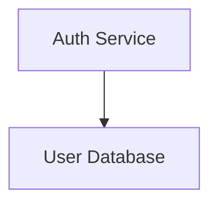

# Design Spec: mermaid-render

**Date:** 2026-03-28
**Status:** Draft

## 1. Problem Statement

Mermaid.js produces static SVGs with no interactivity. Users with complex diagrams (information architecture, C4, service blueprints, data models) face:

- Unreadable diagrams that shrink to fit the page (#1860, #2162 — 46+ reactions)
- No way to collapse complexity (#5508, #1123 — 23+ reactions)
- No way to decompose across files (#4673 — 32 reactions)
- Browser freezing on large inputs (#1216)

These are the most upvoted open issues in the Mermaid repo, unresolved for years.

## 2. Solution

A standalone rendering engine that takes Mermaid's AST and renders it to an interactive WebGL canvas. Two packages:

1. **@mermaid-render/core** — framework-agnostic npm library
2. **@mermaid-render/vscode** — VS Code extension (first consumer)

## 3. Architecture

```
┌─────────────────────────────────────────────────┐
│                  Consumers                       │
│  ┌──────────────┐  ┌──────────┐  ┌───────────┐ │
│  │ VS Code Ext  │  │ Web App  │  │ Embedded  │ │
│  └──────┬───────┘  └────┬─────┘  └─────┬─────┘ │
└─────────┼───────────────┼───────────────┼───────┘
          │               │               │
          ▼               ▼               ▼
┌─────────────────────────────────────────────────┐
│              @mermaid-render/core                 │
│                                                   │
│  ┌───────────┐  ┌──────────┐  ┌───────────────┐ │
│  │  Parser    │  │  Layout  │  │   Renderer    │ │
│  │  Layer     │  │  Engine  │  │   (PixiJS)    │ │
│  │           │  │          │  │               │ │
│  │ Mermaid   │  │ dagre v1 │  │ Scene Graph   │ │
│  │ Parser +  │──▶│ ELK   v2 │──▶│ Interaction  │ │
│  │ Directive │  │          │  │ Zoom/Pan      │ │
│  │ Extractor │  │          │  │ Fold/Unfold   │ │
│  └───────────┘  └──────────┘  └───────────────┘ │
└─────────────────────────────────────────────────┘
```

### 3.1 Parser Layer

**Input:** Raw Mermaid text (string)
**Output:** Parsed graph (nodes, edges, metadata) + extracted directives

Pipeline:
1. **Directive extractor** — regex scan for `%% @link` and other directives, strip them, store separately
2. **Mermaid parser** — pass cleaned text to @mermaid-js/parser, get AST
3. **Graph builder** — transform Mermaid AST into our internal graph representation (nodes, edges, properties, hierarchy)
4. **Directive resolver** — attach extracted directives back to graph nodes

Internal graph format:
```typescript
interface RenderGraph {
  nodes: Map<string, RenderNode>
  edges: RenderEdge[]
  subgraphs: Map<string, RenderSubgraph>
  directives: Directive[]
}

interface RenderNode {
  id: string
  label: string
  type: string // shape type
  children?: string[] // for compound nodes
  links?: CrossFileLink[]
  metadata: Record<string, unknown>
}

interface CrossFileLink {
  targetFile: string // full path
  targetNode?: string // optional fragment
}

interface RenderEdge {
  source: string
  target: string
  label?: string
  style?: EdgeStyle
}

interface RenderSubgraph {
  id: string
  label: string
  nodeIds: string[]
  collapsed: boolean
}
```

### 3.2 Layout Engine

**Input:** RenderGraph
**Output:** Positioned graph (x, y, width, height for each node; waypoints for each edge)

v1: @dagrejs/dagre
- Accepts directed graph, produces layered layout
- Re-run layout when fold state changes (pass only visible nodes)
- Animate transitions between layouts

v2: ELK.js
- Native compound node support (no need to manually filter)
- Hierarchical layout across nesting levels
- Async layout in web worker

v1: Layout runs synchronously on the main thread (dagre on hundreds of nodes < 10ms).
v2: Layout moves to a web worker when ELK.js is introduced (async, cancellable).

### 3.3 Renderer (PixiJS)

**Input:** Positioned graph
**Output:** Interactive WebGL canvas

Components:
- **Viewport container** — handles zoom/pan via wheel and pointer events
- **Node sprites** — rounded rectangles with Canvas-based text labels (v1), MSDF BitmapText (v2)
- **Edge graphics** — bezier curves between nodes, animated on hover
- **Subgraph containers** — PixiJS Containers that group child nodes (fold = hide container children, show summary)
- **Cross-file link indicators** — visual badge on linked nodes (click navigates)
- **Minimap** — small overview in corner showing full diagram with viewport rectangle

Visual features:
- Glow filter on hovered/selected nodes
- Smooth animated transitions on fold/unfold (layout interpolation)
- Edge highlighting on node selection (dim unrelated edges)
- Depth indication via subtle shadows on nested subgraphs

### 3.4 Interaction Model

| Action | Input | Result |
|--------|-------|--------|
| Pan | Click + drag on empty space | Move viewport |
| Zoom | Scroll wheel / pinch | Zoom in/out at cursor |
| Select node | Click node | Highlight node + connected edges |
| Fold/unfold | Double-click subgraph header OR keyboard shortcut | Collapse/expand children, re-layout |
| Cross-file nav | Click link badge on node | Emit event (consumer handles navigation) |
| Fit to view | Keyboard shortcut (F) | Zoom to fit all visible nodes |
| Reset view | Keyboard shortcut (R) | Reset to default zoom/position |

The core engine emits events. Consumers (VS Code, web app) handle navigation and file loading.

```typescript
interface MermaidRenderer {
  // Lifecycle
  mount(canvas: HTMLCanvasElement): void
  destroy(): void

  // Data
  load(source: string): Promise<LoadResult> // Mermaid text
  loadGraph(graph: RenderGraph): void // Pre-parsed graph (for consumers that manipulate the graph before rendering, or for testing)

  // Interaction
  foldNode(nodeId: string): void
  unfoldNode(nodeId: string): void
  fitToView(): void
  resetView(): void
  selectNode(nodeId: string): void

  // Events
  on(event: 'node:click', handler: (e: NodeEvent) => void): void
  on(event: 'node:dblclick', handler: (e: NodeEvent) => void): void
  on(event: 'link:navigate', handler: (link: CrossFileLink) => void): void
  on(event: 'fold:change', handler: (nodeId: string, collapsed: boolean) => void): void
  on(event: 'error', handler: (error: RenderError) => void): void
  on(event: 'warn', handler: (warning: RenderWarning) => void): void
}

interface NodeEvent {
  nodeId: string
  node: RenderNode
  x: number // canvas pixel coordinate
  y: number
  originalEvent: PointerEvent
}
```

## 4. VS Code Extension

### 4.1 File Explorer

- VS Code TreeView in the sidebar
- Shows .mmd files in workspace
- Click to open in the renderer panel
- Icons indicate files with cross-file links

### 4.2 Renderer Panel

- VS Code WebviewPanel
- Loads @mermaid-render/core in the webview
- Watches file for changes, hot-reloads on save
- Handles `link:navigate` events by opening the target file

### 4.3 Directive Resolution

The extension resolves cross-file paths:
- Absolute paths used as-is
- Workspace-relative paths resolved from workspace root
- Invalid paths shown as broken link indicators in the renderer

### 4.4 Commands

| Command | Shortcut | Action |
|---------|----------|--------|
| Mermaid: Open Preview | Ctrl+Shift+M | Open renderer panel for current .mmd file |
| Mermaid: Fold All | — | Collapse all subgraphs |
| Mermaid: Unfold All | — | Expand all subgraphs |
| Mermaid: Fit to View | F (when panel focused) | Zoom to fit |

## 5. Cross-File Linking

### 5.1 Syntax

```
%% @link <nodeId> -> <absolutePath>#<targetNodeId>
```

Examples:


### 5.2 Rules

- Paths are always full (absolute or workspace-relative)
- Fragment (#targetNodeId) is optional — without it, links to the file's root view
- Multiple links per node are allowed
- Directives are comments — standard Mermaid tools render the diagram normally without them

## 6. Node Folding

### 6.1 What Folds

- Mermaid subgraphs are the fold boundary
- Folding hides all child nodes and internal edges
- A folded subgraph shows as a single summary node (label + child count)
- Edges that crossed into the subgraph reroute to the summary node

### 6.2 State

Fold state is per-session (not persisted in the .mmd file). The renderer tracks which subgraphs are collapsed and re-runs layout when fold state changes.

### 6.3 Animation

Fold/unfold transitions:
1. Calculate new layout (target positions)
2. Animate nodes from current to target positions over ~300ms
3. Fade in/out appearing/disappearing nodes

## 7. Diagram Type Support

Priority order for v1:

1. **Flowchart (graph TD/LR)** — most common, subgraphs for folding
2. **Class diagram** — data structures, relationships
3. **C4 diagram** — architectural layers, natural fit for folding
4. **State diagram** — nested states map to folding

Other Mermaid types (sequence, Gantt, pie, git, journey) are lower priority and may render as static fallbacks initially.

## 8. Project Structure

```
mermaid-render/
├── packages/
│   ├── core/
│   │   ├── src/
│   │   │   ├── parser/
│   │   │   │   ├── directive-extractor.ts
│   │   │   │   ├── mermaid-adapter.ts
│   │   │   │   ├── graph-builder.ts
│   │   │   │   └── adapters/
│   │   │   │       ├── flowchart.ts
│   │   │   │       ├── class-diagram.ts
│   │   │   │       ├── c4-diagram.ts
│   │   │   │       └── state-diagram.ts
│   │   │   ├── layout/
│   │   │   │   ├── layout-engine.ts (interface)
│   │   │   │   ├── dagre-layout.ts
│   │   │   │   └── layout-worker.ts
│   │   │   ├── renderer/
│   │   │   │   ├── mermaid-renderer.ts (main class)
│   │   │   │   ├── viewport.ts
│   │   │   │   ├── node-sprite.ts
│   │   │   │   ├── edge-graphic.ts
│   │   │   │   ├── subgraph-container.ts
│   │   │   │   └── minimap.ts
│   │   │   ├── interaction/
│   │   │   │   ├── zoom-pan.ts
│   │   │   │   ├── fold-manager.ts
│   │   │   │   └── selection.ts
│   │   │   ├── types.ts
│   │   │   └── index.ts
│   │   ├── package.json
│   │   └── tsconfig.json
│   └── vscode/
│       ├── src/
│       │   ├── extension.ts
│       │   ├── file-explorer.ts
│       │   ├── renderer-panel.ts
│       │   └── directive-resolver.ts
│       ├── package.json
│       └── tsconfig.json
├── docs/
├── package.json (workspace root)
├── pnpm-workspace.yaml
├── tsconfig.json (base)
└── README.md
```

## 9. Testing Strategy

- **Unit tests** — parser, directive extractor, graph builder, fold logic
- **Layout tests** — given a graph, assert node positions are reasonable (no overlaps, correct hierarchy)
- **Renderer tests** — PixiJS with headless-gl for CI, or snapshot-based visual regression
- **Integration tests** — full pipeline: Mermaid text → rendered canvas assertions
- **VS Code extension tests** — vscode-test framework for extension activation and commands

## 10. Error Handling

### 10.1 Parse Errors

When Mermaid parsing fails, the renderer:
- Emits an `error` event with the parse error details
- Shows the last successfully rendered graph (if any)
- Displays an error overlay banner at the top of the canvas with the error message
- Does NOT blank the canvas — stale-but-visible is better than nothing

### 10.2 Directive Errors

- `@link` referencing a non-existent node ID: ignore the directive, log a warning via `warn` event
- `@link` with an invalid path: render the node normally but show a broken-link badge (red). Consumer decides how to handle.
- Duplicate `@link` to the same target on the same node: deduplicate silently

### 10.3 Layout Errors

- Degenerate layout (cycles causing overlap): dagre handles cycles by breaking them. If layout produces zero-area results, fall back to a simple grid layout.
- Layout timeout: if layout exceeds 2 seconds, cancel and show a warning ("Diagram too large for interactive layout"). Render nodes in a grid as fallback.

### 10.4 Renderer API Error Contract

```typescript
interface MermaidRenderer {
  // ... existing methods ...

  // load() returns a result, does not throw
  load(source: string): Promise<LoadResult>

  // Events
  on(event: 'error', handler: (error: RenderError) => void): void
  on(event: 'warn', handler: (warning: RenderWarning) => void): void
}

interface LoadResult {
  success: boolean
  graph?: RenderGraph
  errors?: RenderError[]
  warnings?: RenderWarning[]
}

interface RenderError {
  code: string // e.g. 'PARSE_FAILED', 'LAYOUT_TIMEOUT'
  message: string
  line?: number // source line if applicable
}
```

### 10.5 Concurrent Loads

When `load()` is called while a previous layout is running:
- Cancel the in-progress layout (terminate worker message)
- Start the new layout
- Only the most recent `load()` call resolves

## 11. Performance Strategy

### 11.1 Budget

| Metric | Target |
|--------|--------|
| Initial render (< 200 nodes) | < 500ms |
| Layout recalculation (fold/unfold) | < 200ms |
| Zoom/pan frame rate | 60fps |
| Memory ceiling | < 200MB for diagrams up to 2,000 nodes |

### 11.2 Degradation Tiers

| Node count | Behavior |
|------------|----------|
| 0–500 | Full features: animations, glow, edge effects |
| 500–2,000 | Reduce visual effects: disable glow filters, simplify edge rendering |
| 2,000–5,000 | Warning banner. Disable animations. Static layout only. |
| 5,000+ | Refuse to render. Show message: "Diagram too large. Use node folding or split into multiple files." |

### 11.3 Layout Worker

v1: dagre runs synchronously on the main thread (< 10ms for hundreds of nodes, not worth worker overhead).
v2: when migrating to ELK.js, layout moves to a web worker with cancellation support.

## 12. Parser Stability

### 12.1 @mermaid-js/parser Risk

The Mermaid parser's AST format is not a stable public API. To mitigate:

- **Pin the parser version** in package.json (no caret ranges)
- **mermaid-adapter.ts is the isolation boundary** — all Mermaid parser output is transformed into our `RenderGraph` format at this layer. The rest of the codebase never touches Mermaid types.
- **Per-diagram-type adapters** — graph-builder.ts will contain adapter functions per diagram type (flowchart, class, C4, state) since Mermaid's AST structure differs per type. These live in `parser/adapters/`.

### 12.2 Updated Project Structure (parser)

```
parser/
├── directive-extractor.ts
├── mermaid-adapter.ts       # Thin wrapper around @mermaid-js/parser
├── graph-builder.ts         # Dispatches to per-type adapters
└── adapters/
    ├── flowchart.ts
    ├── class-diagram.ts
    ├── c4-diagram.ts
    └── state-diagram.ts
```

### 12.3 Fallback

If a future Mermaid parser update breaks our adapter, the pinned version continues working. We update adapters on our schedule, not Mermaid's.

## 13. Text Rendering Strategy

v1: Use PixiJS Canvas-based text rendering (Text class). This uses an offscreen `<canvas>` to rasterize text and upload as a texture. It handles:
- Any system font
- Full Unicode
- Word wrapping
- No atlas generation required

v2: Migrate high-frequency labels to MSDF BitmapText for better scaling performance. This requires:
- Pre-generated font atlas for the default font (bundled)
- Fallback to Canvas text for unsupported glyphs

Canvas text is the pragmatic v1 choice — it works everywhere, handles all characters, and performs fine for hundreds of nodes.

## 14. Cross-File Path Resolution

### 14.1 Path Syntax

All paths in `@link` directives use **workspace-relative paths** starting with `/`:

```
%% @link nodeA -> /services/auth/flow.mmd#loginNode
```

- `/` means workspace root (not filesystem root)
- No relative paths (no `./` or `../`) — keeps directives unambiguous regardless of file location
- The core engine receives paths as-is. The consumer (VS Code extension, web app) resolves them against its root.

### 14.2 Resolution in VS Code

The extension prepends the workspace root to resolve the full filesystem path. If the path doesn't exist, the renderer shows a broken-link indicator.

## 15. Edge Cases

### 15.1 Circular Cross-File Links

File A links to File B, which links back to A. The VS Code extension maintains a navigation history stack. Back button (or keyboard shortcut) pops the stack. No cycle detection needed — the user navigates intentionally.

### 15.2 Empty Subgraphs

Subgraphs with zero nodes render as a minimum-size empty container (80x40px) with just the label. They are foldable but folding has no visible effect.

### 15.3 Deep Nesting

Fold/unfold logic is recursive. Folding a parent subgraph collapses all descendants. Edge rerouting walks the subgraph tree: any edge with a source or target inside the folded subtree reroutes to the summary node. Duplicate rerouted edges are merged (show the edge once with a count badge if multiple edges merged).

### 15.4 Long Node Labels

Labels exceeding 200 characters are truncated with ellipsis. Full text shown in a tooltip on hover. Word wrapping applies within the node's max-width (computed from label length up to a cap of 300px).

## 16. Build Toolchain

- **Monorepo:** pnpm workspaces
- **Core library build:** tsup (esbuild-based, outputs ESM + CJS + types)
- **VS Code extension build:** esbuild (standard for VS Code extensions)
- **API:** 0.x versioning until API stabilizes. `MermaidRenderer` interface is the public contract.
- **CI:** GitHub Actions — lint (eslint), typecheck (tsc --noEmit), test (vitest), build

## 17. Non-Goals (v1)

- Inline editing of diagrams
- Real-time collaboration
- Accessibility (screen readers, ARIA) — note: WebGL canvases are inherently inaccessible. v2+ accessibility will require a parallel ARIA tree or alternative DOM-based rendering mode. Current architecture does not preclude this.
- Export to image/PDF
- Custom themes (beyond basic light/dark)
- Server-side rendering
- Mermaid Live Editor replacement
- "Framework-agnostic" means no React/Vue/Angular dependency. A browser environment with HTMLCanvasElement and WebGL support is required.
