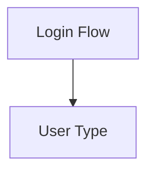

# Tech Stack Decisions

## Architecture

Two separate packages in a pnpm monorepo:

1. **@mermaid-render/core** — standalone rendering engine (npm library)
   - Framework-agnostic, renders to any `<canvas>` element
   - No VS Code dependency
   - Publishable on npm for anyone to embed

2. **@mermaid-render/vscode** — VS Code extension
   - Consumes the core library in a webview panel
   - Adds file explorer sidebar (TreeView API)
   - Resolves full-path cross-file links within the workspace

## Parser: @mermaid-js/parser + Custom Directive Layer

**Decision:** Reuse Mermaid's official parser for syntax → AST. Add a lightweight preprocessing layer for comment-based directives.

**Rationale:**
- Official parser stays in sync with Mermaid syntax evolution
- Our directives live in comments (`%% @link nodeA -> /path/to/file.mmd#nodeId`)
- Standard Mermaid tools ignore comments — zero compatibility breakage
- Avoids maintaining a full parser fork

**Risk:** Mermaid's JISON-based parsers discard comments during lexing. Our directive layer must extract directives before passing to the parser.

## Layout: @dagrejs/dagre (v1), ELK.js (v2)

**Decision:** Start with dagre, plan migration to ELK.js.

**Rationale:**
- dagre: ~30KB, fast, simple API, good enough for directed hierarchical graphs
- ELK.js: ~8MB (GWT-transpiled Java), excellent compound node support, but massive bundle
- v1 gets node folding working with dagre by re-running layout on visible nodes
- v2 migrates to ELK.js when compound/nested node layout demands it

**Alternative considered:** WebCola (~150KB, constraint-based). Middle ground if dagre falls short before ELK migration.

## Renderer: PixiJS (WebGL + Canvas 2D Fallback)

**Decision:** PixiJS as the rendering engine.

**Rationale:**
- WebGL-accelerated but high-level API (scene graph, not raw GL calls)
- ~200KB bundle
- Built-in MSDF/SDF BitmapText — crisp text at any zoom level
- Scene graph with containers — maps directly to node folding (container show/hide)
- Hit detection, events, drag/drop built in — sets up editing features for v2
- Filters and shaders for visual polish (glow, bloom, animated edges)
- Works in VS Code webviews (standard Chromium WebGL)
- Canvas 2D fallback for environments without WebGL

**Alternatives considered:**
- Raw Canvas 2D: Simpler but no scene graph, manual hit-testing, text is harder
- Raw WebGL: Maximum control but text rendering is painful, much more code
- Three.js: Overkill for 2D diagrams (~600KB)

## Rendering Performance Expectations

Based on benchmarks (SVG Genie, 2025):

| Tech | 60fps ceiling |
|------|--------------|
| SVG | ~3,000-5,000 elements |
| Canvas 2D | ~50,000 elements |
| WebGL (PixiJS) | ~100,000+ elements |

Architectural diagrams with folding will rarely exceed a few hundred visible nodes. PixiJS gives us massive headroom.

## Cross-File Linking Syntax

- Full absolute or workspace-relative paths
- Fragment identifier (#nodeId) for targeting specific nodes
- Comment-based — invisible to standard Mermaid parsers

## Language: TypeScript

Strong typing for AST manipulation, graph structures, and the PixiJS scene graph. Standard npm/pnpm tooling.

## Editing (v2 Architecture Notes)

PixiJS scene graph makes editing viable:
- Every node is an interactive object with hit detection
- Drag and drop is native (pointermove events)
- Inline text editing: HTML input overlay at pixel position, sync back to PixiJS
- Transform handles via additional sprites on selected nodes

This is a well-known pattern — choosing PixiJS now avoids a renderer rewrite when editing ships.

## Bundle Size Budget

| Component | Size |
|-----------|------|
| @mermaid-js/parser | ~50KB (estimated) |
| @dagrejs/dagre | ~30KB |
| PixiJS | ~200KB |
| Our code | ~50KB (estimated) |
| **Total core engine** | **~330KB** |

vs. 8MB+ if we used ELK.js from day one.
