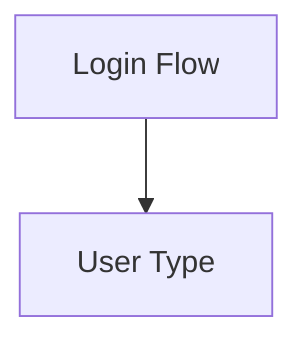

# Tech Stack Decisions

## Architecture

This repo is a pnpm monorepo. The current v1 release scope ships the web artifacts below:

1. **@mermaid-render/core** — standalone rendering engine (npm library)
   - Framework-agnostic, renders to any `<canvas>` element
   - No VS Code dependency
   - Publishable on npm for anyone to embed

2. **Static demo web app** — built from `packages/core/dist-demo/`
   - Plain static-host deployment target
   - Exercises bundled examples, philosophy switching, and browser-side cross-file navigation

The repo also contains `@mermaid-render/vscode` as a future shell, but it is outside the current `goal.md` v1 web release scope.

## Parser: Mermaid + Custom Directive Layer

**Decision:** Reuse Mermaid's parser/runtime for syntax → graph data, loaded lazily at runtime. Add a lightweight preprocessing layer for comment-based directives.

**Rationale:**
- Mermaid compatibility stays aligned with the shipped Mermaid version
- Our directives live in comments (`%% @link nodeA -> /path/to/file.mmd#nodeId`)
- Standard Mermaid tools ignore comments — zero compatibility breakage
- Lazy import keeps Mermaid's parser registry out of the initial demo entry chunk

**Risk:** Mermaid's parser internals are not a stable public API. The adapter layer in `src/parser/mermaid-adapter.ts` isolates that dependency, and our directive extractor still has to run before Mermaid consumes the source because Mermaid discards comments during parsing.

## Layout: @dagrejs/dagre (v1), ELK.js (v2)

**Decision:** Start with dagre, plan migration to ELK.js.

**Rationale:**
- dagre: ~30KB, fast, simple API, good enough for directed hierarchical graphs
- ELK.js: ~8MB (GWT-transpiled Java), excellent compound node support, but massive bundle
- v1 gets node folding working with dagre by re-running layout on visible nodes
- v2 migrates to ELK.js when compound/nested node layout demands it

**Alternative considered:** WebCola (~150KB, constraint-based). Middle ground if dagre falls short before ELK migration.

## Renderer: PixiJS (WebGPU/WebGL)

**Decision:** PixiJS as the rendering engine.

**Rationale:**
- WebGL-accelerated but high-level API (scene graph, not raw GL calls)
- ~200KB bundle
- Built-in MSDF/SDF BitmapText — crisp text at any zoom level
- Scene graph with containers — maps directly to node folding (container show/hide)
- Hit detection, events, drag/drop built in — sets up editing features for v2
- Filters and shaders for visual polish (glow, bloom, animated edges)
- Works in browsers and VS Code webviews through GPU-backed rendering
- Current implementation prefers WebGPU when available and otherwise falls back to WebGL

**Alternatives considered:**
- Raw Canvas 2D: Simpler but no scene graph, manual hit-testing, text is harder
- Raw WebGL: Maximum control but text rendering is painful, much more code
- Three.js: Overkill for 2D diagrams (~600KB)

**Important correction:** PixiJS v8 does not give this project a built-in Canvas 2D fallback. If no usable GPU backend is available, the current v1 implementation must surface a readable failure state rather than claiming a renderer fallback that does not exist.

## Rendering Performance Expectations

High-level industry benchmarks are still directionally useful:

| Tech | 60fps ceiling |
|------|--------------|
| SVG | ~3,000-5,000 elements |
| Canvas 2D | ~50,000 elements |
| WebGL (PixiJS) | ~100,000+ elements |

For this codebase, the authoritative numbers are the browser harness runs in `packages/core/dev/perf-harness.ts` and the Playwright browser suite:

| Scenario | Nodes | Edges | Load time | Avg frame | Approx FPS |
|----------|------:|------:|----------:|----------:|-----------:|
| Representative graph | 7 | 6 | ~73ms | ~10.4ms | ~95.9 |
| Stress graph | 220 | 294 | ~243ms | ~9.5ms | ~105.0 |

Current v1 performance contract:

- The renderer is browser-verified for interactive use through at least `220` nodes / `294` edges.
- Above that floor, rendering remains best-effort rather than guaranteed at 60fps.
- When a diagram exceeds that verified floor, `load()` now emits `PERF_STRESS_THRESHOLD` and the renderer switches into a stress mode instead of degrading silently.
- Stress mode currently disables cross-file hover previews, skips relayout fade animation, avoids hover-time edge dimming work on large graphs, hides edge labels, and suppresses subgraph chevrons/count badges. These behaviors now have direct browser coverage, not just implementation intent.
- The intended authoring response is to reduce visible complexity with folding, focus navigation, or cross-file `%% @link` splits.

Animation/runtime note:

- Non-Blueprint relayouts with stable node, edge, and subgraph identity now animate in place on the Pixi ticker rather than only crossfading whole-scene rebuilds.
- During that motion pass, node positions, edge paths, and subgraph bounds are interpolated together every tick, so edge endpoints stay attached while nodes move.
- The shipped runtime now uses one coordinated Pixi ticker clock for viewport motion, relayout fade, and in-place relayout motion. The old dormant `LayoutAnimator` branch has been removed instead of kept as a second unused animation subsystem.

## Routing Guarantees By Philosophy

- `blueprint` is the only shipped philosophy with a collision-aware wire router.
- `narrative` trims edges to node boundaries and applies limited straight-line collision avoidance, but it does not guarantee fully obstacle-free routing.
- When a non-Blueprint rendered edge still crosses an unrelated node footprint, the runtime now emits `EDGE_NODE_CROSSING` instead of failing silently.
- `map`, `breath`, `radial`, and `mosaic` currently inherit Dagre-style edge routing and should be treated as visual presets, not collision-free routers.

Current Blueprint router contract:

- Node occupancy is based on the rendered footprint, not only the raw layout width, so long labels reserve the space the user actually sees.
- Edge ordering is deterministic: routing is processed in a stable edge-id order rather than whichever edge order happened to be in memory.
- If A* cannot find a free orthogonal path, the wire still renders through an explicit direct fallback route and `RouteResult.congested` is set to `true` instead of silently dropping the edge.
- The practical routing ceiling follows the current browser-verified interactive floor: Blueprint routing is treated as supported through roughly `220` nodes / `294` edges. Past that, routing remains best-effort and authors should expect to lean on folding, focus, or cross-file splits instead of one giant routed canvas.

This ceiling is documented rather than hidden because Blueprint routing allocates an occupancy grid over layout bounds and routes wires greedily into that grid. Larger, sparser diagrams cost more memory and make lane contention more likely even when the rest of the renderer still draws.

## Cross-File Linking Syntax



- Full absolute or workspace-relative paths
- Fragment identifier (#nodeId) for targeting specific nodes
- Comment-based — invisible to standard Mermaid parsers

## Browser Resolver Contract

For the web build, path resolution is an explicit trust boundary:

- Author-provided `targetFile` strings are never fetched directly.
- Consumers provide a `linkResolver` with:
  - `canonicalize(targetFile, fromFile)` → canonical `.mmd` key or `null`
  - `read(canonicalFile)` → Mermaid source from an allowlisted store or virtual file map
- Relative targets resolve from the current file, absolute targets stay rooted, extensionless targets gain `.mmd`, and `.` / `..` are normalized.
- Out-of-scope targets are rejected during canonicalization rather than passed through to `fetch()`.

## Language: TypeScript

Strong typing for AST manipulation, graph structures, and the PixiJS scene graph. Standard npm/pnpm tooling.

## Editing (v2 Architecture Notes)

PixiJS scene graph makes editing viable:
- Every node is an interactive object with hit detection
- Drag and drop is native (pointermove events)
- Inline text editing: HTML input overlay at pixel position, sync back to PixiJS
- Transform handles via additional sprites on selected nodes

This is a well-known pattern — choosing PixiJS now avoids a renderer rewrite when editing ships.

## Bundle Size Budget

| Component | Size |
|-----------|------|
| Mermaid parser/runtime | Included via lazy dynamic import |
| @dagrejs/dagre | ~30KB |
| PixiJS | ~200KB |
| Our code | ~50KB (estimated) |
| **Total core engine** | **~330KB** |

This budget applies to the publishable core library, not the demo app shell.

For the static demo shell, v1 now uses a separate enforced budget:

- demo entry raw: `500 KiB`
- demo entry gzip: `160 KiB`

That higher ceiling is intentional. The demo bundle includes:

- the PixiJS renderer runtime
- the browser harness UI and verification hooks
- the lazy Mermaid parser loader path
- example navigation, status surfaces, and preview plumbing that are not part of the npm library surface

Current measured outputs:

- `@mermaid-render/core` build output:
  - `dist/index.js`: ~`202.28 KiB`
  - `dist/index.cjs`: ~`204.57 KiB`
- Demo web app entry chunk:
  - latest `packages/core/dist-demo/assets/index-*.js`: ~`478.06 KiB` minified / `137.36 KiB` gzip

The bundled example `.mmd` files are now lazy-loaded as separate static chunks instead of being inlined into the initial demo entry bundle. That reduced the entry chunk slightly and, more importantly, removed example corpus size from the first-load cost. The remaining large first chunk is now mostly renderer/runtime code rather than raw example content.

The core library is comfortably inside the original budget. The demo app now has an explicit, separately enforced budget because it is a deployable reference app rather than the publishable embed surface. Further reduction is still possible, but it is no longer an undocumented exception.

## Release Verification

Current reproducible release gate from the repo root:

```bash
pnpm verify:core
```

Latest verified current-tree result:

- unit tests: `140` passed
- browser tests: `74` passed
- built static demo smoke test: passed
- lint, typecheck, core build, demo build, bundle-budget check, and `npm pack --dry-run`: passed

That runs lint, typecheck, unit tests, browser render tests, the core build, the static demo build, a smoke test against the built static demo artifact served from a plain file host, and both bundle-budget checks.

vs. 8MB+ if we used ELK.js from day one.
